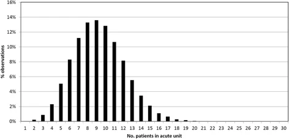
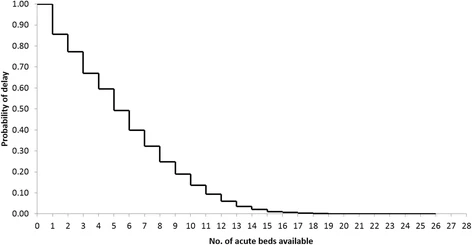

<div align="center">

# Stroke capacity planning model: R DES RAP

<!-- badges: start -->


[](https://doi.org/10.5281/zenodo.15863376)
[](https://github.com/pythonhealthdatascience/rdesrap_stroke/actions/workflows/R-CMD-check.yaml)
[](https://github.com/pythonhealthdatascience/rdesrap_stroke/actions/workflows/lint.yaml)
[](https://orcid.org/0000-0002-6596-3479)
[](https://app.codecov.io/gh/pythonhealthdatascience/rdesrap_stroke)
<!-- badges: end -->
</div>

<br>

## Repository overview

This repository provides a reproducible analytical pipeline (RAP) that implements a real-life stroke service capacity planning model in R. It serves as a practical example, fully reproducible and aligned with RAP principles, based on the following study:

> Monks T, Worthington D, Allen M, Pitt M, Stein K, James MA. A modelling tool for capacity planning in acute and community stroke services. BMC Health Serv Res. 2016 Sep 29;16(1):530. doi: [10.1186/s12913-016-1789-4](https://doi.org/10.1186/s12913-016-1789-4). PMID: 27688152; PMCID: PMC5043535.

Model diagram:


<br>

## Installation

Clone the repository:

```{.r}
git clone https://github.com/pythonhealthdatascience/rdesrap_stroke.git
cd rdesrap_stroke
```

Set up the R environment using `renv` (recommended):

```{.r}
renv::init()
renv::restore()
```

If you encounter issues restoring the exact environment, you can install dependencies from `DESCRIPTION` and generate your own lock file:

```{.r}
renv::init()
renv::install()
renv::snapshot()
```

<br>

## How to run

The simulation code is in the `R/` folder as a local package. There are files executing the model and analysing the results in `rmarkdown/`.

**Install the local package:**

```{.r}
devtools::install()  # Needed if running in parallel
devtools::load_all()  # Sufficient if running sequentially

library(simulation)
```

**Run a single simulation:**

```{.r}
param <- create_parameters(number_of_runs = 1L)
single_results <- runner(param = param)
```

**Run multiple replications:**

```{.r}
param <- create_parameters(number_of_runs = 5L)
single_results <- runner(param = param)
```

**Run all analyses (from command line):**

```{.r}
bash run_rmarkdown.sh
```

**Run tests:**

```{.r}
devtools::test()
```

**Compute test coverage:**

```{.r}
devtools::test_coverage()
```

**Lint code:**

```{.r}
lintr::lint_dir()
```

### Generating the results from the article

The original study used Simul8. Each of the outputs from that article have been replicated in this repository using R:

* Figure 1. Simulation probability density function for occupancy of an acute stroke unit.
* Figure 3. Simulated trade-off between the probability that a patient is delayed and the no. of acute beds available.
* Table 2. Likelihood of delay. Current admissions versus 5% more admissions.
* Table 3. Results of pooling of acute and rehab beds.
* Supplementary Table 1. Likelihood of delay. Current admissions versus No Complex neurological patients.
* Supplementary Table 3. Likelihood of delay. Current admissions versus ring fenced acute stroke beds.

To generate these, simply execute `rmarkdown/analysis.Rmd`.

**Examples**

**Figure 1**

Original:



From this repository:


**Figure 3**

Original:



From this repository:


<br>

## Run time and machine specification

The run time for this analysis (`notebooks/analysis.Rmd`) is **1m 38s** seconds. This was on an Intel Core i7-12700H, 32GB RAM, Ubuntu 24.04.1.

The other notebooks generate results for tests and illustrate other functionality (e.g. importing parameters from csv, running with logs), and these just take a second or two.

<br>

## Citation

If you use this repository, please cite either the GitHub repository or Zenodo:

> Heather, A. (2025). Stroke capacity planning model: R DES RAP. GitHub. https://github.com/pythonhealthdatascience/rdesrap_stroke.
>
> Heather, A. (2025). Stroke capacity planning model: R DES RAP. Zenodo. https://doi.org/10.5281/zenodo.15863376.

**Contributors:**

**Amy Heather** - developed the repository.

* [](https://orcid.org/0000-0002-6596-3479)
* [](https://github.com/amyheather)

<br>

## Licence

MIT Licence. See `LICENSE.md` for details.

<br>

## Acknowledgements

This repository was developed with thanks to a few others sources. These are acknowledged throughout in the relevant scipts, and also summarised here:

**TODO**

<br>

## Funding

This project was developed as part of the project STARS: Sharing Tools and Artefacts for Reproducible Simulations. It is supported by the Medical Research Council [grant number [MR/Z503915/1](https://gtr.ukri.org/projects?ref=MR%2FZ503915%2F1)].
