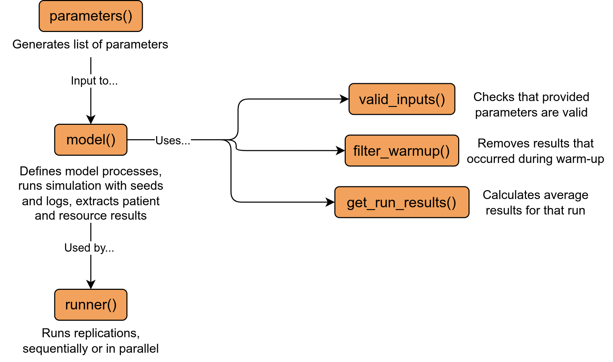

<div align="center">

# Simple M/M/s queuing model: R DES RAP

<!-- badges: start -->


[](https://doi.org/10.5281/zenodo.14980863)
[](https://github.com/pythonhealthdatascience/rdesrap_mms/actions/workflows/R-CMD-check.yaml)
[](https://github.com/pythonhealthdatascience/rdesrap_mms/actions/workflows/lint.yaml)
[](https://orcid.org/0000-0002-6596-3479)
<!-- badges: end -->
</div>

<br>

## Repository overview

This repository provides a reproducible analytical pipeline (RAP) for a simple **M/M/s queuing model** implemented in R using simmer. The model simulates patients arriving, waiting to see a nurse, being served, and leaving. All code is structured as a local R package.

An M/M/s queueing model is a classic mathematical model for systems where:

* Arrivals happen at random, following a Poisson process - and the time between arrivals follows an exponential distribution (the first "M", which stands for "Markovian" as it is memoryless - arrivals are independent).
* Service times are exponential (second "M").
* There are s parallel servers (e.g. nurses) sharing a single queue.

This type of model is widely used for studying waiting lines in healthcare, call centers, and other service systems. It helps answer questions like: How long will people wait? How many servers are needed to keep waits short? The only required inputs are the average arrival rate, average service time, and the number of servers.

<br>

## Installation

Clone the repository:

```{.r}
git clone https://github.com/pythonhealthdatascience/rdesrap_mms.git
cd rdesrap_mms
```

Set up the R environment using `renv` (recommended):

```{.r}
renv::init()
renv::restore()
```

If you encounter issues restoring the exact environment, you can install dependencies from `DESCRIPTION` and generate your own lock file:

```{.r}
renv::init()
renv::install()
renv::snapshot()
```

### System dependencies

Some packages (e.g. `igraph`) may require system libraries. For example, for Ubuntu:

```{.bash}
sudo apt install build-essential gfortran
sudo apt install libglpk-dev libxml2-dev
```

<br>

## How to run

The simulation code is in the `R/` folder as a local package. Example analyses and model runs are in `rmarkdown/`.

**Install the local package:**

```{.r}
devtools::install()
library(simulation)
```

**Run a single simulation:**

```{.r}
params <- parameters(patient_inter = 2L, mean_n_consult_time = 4L, number_of_nurses = 2L)
result <- model(params)
```

**Run multiple replications:**

```{.r}
params <- parameters(patient_inter = 2L, mean_n_consult_time = 4L, number_of_nurses = 2L, number_of_runs = 10L)
results <- runner(params)
```

**Run all example analyses (from command line):**

```{.bash}
bash run_rmarkdown.sh
```

**Run tests:**

```{.r}
devtools::test()
```

**Lint code:**

```{.r}
lintr::lint_package()
lintr::lint_dir("rmarkdown")
```

<br>

## ❓ How does the model work

The model is built around three main functions, designed for flexibility and easy scenario analysis.

**1. parameters()**. This function creates a list of all inputs needed for the simulation - such as arrival rate, service rate, and number of nurses. You can quickly change parameters for a scenario by calling, for example:

```{.r}
params <- parameters(patient_inter = 10L)
```

Any values you don't specify will use the defaults set in `R/parameters.R`. To permanently change a default, edit the values directly in the `parameters()` function inside `R/parameters.R`.

**2. model()**. This function runs a single simulation using the parameters you provide. Example:

```{.r}
result <- model(params)
```

**3. runner()**. For robust results, you’ll usually want to run the simulation multiple times (replications). Example:

```{.r}
results <- runner(params)
```

You can set the number of replications in your parameters:

```{.r}
params <- parameters(number_of_runs = 20)
```

To summarise, we create or modify a parameter set with `parameters()`, run a single simulation with `model()`, or many with `runner()`, and analyse the results (e.g. in the provided RMarkdown files). This diagram provides an overview of the functions:



<br>

## Reproducing results

To generate the figures and tables from the paper (`mock_paper.md`), execute:

* **Figure 1-4**: `rmarkdown/analysis.Rmd`
* **Figure A.1-A.2:** `rmarkdown/input_modelling.Rmd`
* **Figure B.1:** `rmarkdown/choosing_warmup.Rmd`
* **Figure C.1-C.3:** `rmarkdown/choosing_replications.Rmd`

<br>

## Input data

**Patient-level data** for our system is provided in the file: `inputs/NHS_synthetic.csv`.

**Data dictionary** (explaining each field) is available in: `inputs/NHS_synthetic_dictionary.csv`.

This dataset is **synthetic** and was generated in the [pydesrap_mms](https://github.com/pythonhealthdatascience/pydesrap_mms) repository based on the the structure of some fields from the [Emergency Care Data Set (ECDS)](https://digital.nhs.uk/data-and-information/data-collections-and-data-sets/data-sets/emergency-care-data-set-ecds). The data generation process involved:

* **Arrivals:** Sampled from a Poisson distribution (average 15 patients per hour).
* **Wait times:** Sampled from an exponential distribution (average wait time: 5 minutes).
* **Service times:** Sampled from an exponential distribution (average service time: 10 minutes).
* **Time period:** Data covers one full year (1st January - 31st December 2025).

This dataset is released under the MIT licence. If you use this data, please cite the original repository: [pydesrap_mms](https://github.com/pythonhealthdatascience/pydesrap_mms).

The code for input modelling is in: `rmarkdown/input_modelling.Rmd`. Model parameters are determined in this file and then stored in: `R/parameters.R`. Description for each parameter can be found in the class docstring within this file.

<br>

## GitHub actions

GitHub actions in `.github/workflows/` automate testing and code checks.

* **R-CMD-check.yaml** runs `devtools::check()` on Ubuntu, Windows, and Mac after each push to main, ensuring the package build and tests pass across platforms.
* **lint.yaml** checks code style in R scripts and RMarkdown files to maintain code quality.

<br>

## Repository structure

```
repo/
├── .github/workflows/          # GitHub actions
├── docs/                       # Documentation
├── images/                     # Image files and GIFs
├── inputs/                     # Model inputs
├── inst/                       # Files to include in installed package (e.g. CITATION)
├── man/                        # Function documentation generated by roxygen
├── outputs/                    # Folder to save any outputs from model
├── R/                          # Local package containing code for the DES model
├── renv/                       # Instructions for creation of R environment
├── rmarkdown/                  # .Rmd files to run DES model and analyse results
├── tests/                      # Unit and back testing of the DES model
├── .gitignore                  # Untracked files
├── .lintr                      # Lintr settings
├── .Rbuildignore               # Files and directories to exclude when building the package
├── .Rprofile                   # R session configuration file
├── CITATION.cff                # How to cite the repository
├── CONTRIBUTING.md             # Contribution instructions
├── DESCRIPTION                 # Metadata for the R package, including dependencies
├── LICENSE                     # Licence file for the R package
├── LICENSE.md                  # MIT licence for the repository
├── mock_paper.md               # Mock paper using some of the figures
├── NAMESPACE                   # Defines the exported functions and objects for the R package
├── NEWS.md                     # Describes changes between releases (equivalent to a changelog for R packages)
├── rdesrap_mms.Rproject # Project settings
├── README.md                   # This file! Describes the repository
├── renv.lock                   # Lists R version and all packages in the R environment
└── run_rmarkdown.sh            # Bash script to run knit all .Rmd from the command line
```

<br>

## Run time and machine specification

Run times from our analyses (on Intel Core i7-12700H, 32GB RAM, Ubuntu 24.04.1):

* `analysis.Rmd`: 2m 12s
* `choosing_cores.Rmd`: 2m 12s
* `choosing_replications.Rmd`: 1m 35s
* `choosing_warmup.Rmd`: 3s
* `generate_exp_results.Rmd`: 2s
* `input_modelling.Rmd`: 13s

There are also two notebooks illustrating logging functionality (`logs.Rmd`) and about the impact of using `set_attributes()` and `get_attributes` (`using_set_attributes.Rmd`).

<br>

## Citation

If you use this repository, please cite either the GitHub repository or Zenodo:

> Heather, A. (2025). R DES Rap Template. GitHub. https://github.com/pythonhealthdatascience/rdesrap_mms.
>
> Heather, A. (2025). R DES Rap Template. Zenodo. https://doi.org/10.5281/zenodo.14980863.

**Contributors:**

**Amy Heather** - developed the repository.

* [](https://orcid.org/0000-0002-6596-3479)
* [](https://github.com/amyheather)

**Tom Monks** - peer review of the repository.

* [](https://orcid.org/0000-0003-2631-4481)
* [](https://github.com/TomMonks)

<br>

## Licence

MIT Licence. See `LICENSE.md` for details.

<br>

## Acknowledgements

This repository was developed with thanks to a few others sources. These are acknowledged throughout in the relevant scipts, and also summarised here:

| Source | Find out more about how it was used... |
| - | - |
| Ucar I, Smeets B (2023). simmer.plot: Plotting Methods for 'simmer'. https://r-simmer.org. https://github.com/r-simmer/simmer.plot. | `R/get_run_results.R` |
| Tom Monks (2021) sim-tools: fundamental tools to support the simulation process in python (https://github.com/TomMonks/sim-tools) (MIT Licence).<br> Who themselves cite Hoad, Robinson, & Davies (2010). Automated selection of the number of replications for a discrete-event simulation (https://www.jstor.org/stable/40926090), and Knuth. D "The Art of Computer Programming" Vol 2. 2nd ed. Page 216. | `R/choose_replications.R` |

<br>

## Funding

This project was developed as part of the project STARS: Sharing Tools and Artefacts for Reproducible Simulations. It is supported by the Medical Research Council [grant number [MR/Z503915/1](https://gtr.ukri.org/projects?ref=MR%2FZ503915%2F1)].
