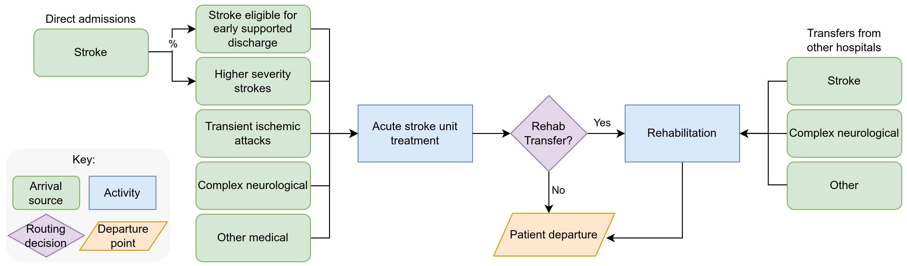

# Strengthening the Reporting of Empirical Simulation Studies (STRESS)

**Discrete-event simulation guidelines (STRESS-DES) Version 1.0**

This checklist describes the study:

> Monks T, Worthington D, Allen M, Pitt M, Stein K, James MA. A modelling tool for capacity planning in acute and community stroke services. BMC Health Serv Res. 2016 Sep 29;16(1):530. doi: [10.1186/s12913-016-1789-4](https://doi.org/10.1186/s12913-016-1789-4). PMID: 27688152; PMCID: PMC5043535.

Answers to this checklist, and the diagram used, are copied and/or adapted from [llm_simpy/notebooks/03_stroke/00_stress/](https://github.com/pythonhealthdatascience/llm_simpy/tree/main/notebooks/03_stroke/00_stress), which is shared under an MIT licence by:

> Monks, T., Harper, A., & Heather, A. (2025). Unlocking the Potential of Past Research: Using Generative AI to Reconstruct Healthcare Simulation Models. GitHub. https://github.com/pythonhealthdatascience/llm_simpy.

| **Item** | **Description** |
| - | - |
| **Objectives** | 
| **1.1 Purpose of the model** Explain the background and objectives for the model | The simulation model provides capacity planning tools for acute stroke and rehabilitation units across a shared service that cares for Stroke, TIA, Complex Neurology and other types of neurological dependency patients. It guides users on the likelihood that a given capacity will cause admission delays. |
| **1.2 Model outputs** Define all quantitative performance measures that are reported, using equations where necessary.  Specify how and when they are calculated during the model run along with how any measures of error such as confidence intervals are calculated. | At the end of a model run the following is calculated: ・ The probability of delay - p(delay) - in admission to an Acute Stroke Unit by bed numbers. ・ The probability of delay - p(delay) - in admission to a Rehabilitation Unit by bed numbers. ・ The reciprocal of p(delay) for both ASU and Rehab. Interpreted as 1 in every n patients is delayed. ・ The occupancy distribution of the Acute Stroke Unit. ・ The occupancy distribution of the Rehabilitation Unit The probability of delay is calculated as follows: `P(N=n)/P(<=n)` |
| **1.3 Experimentation aims** If the model has been used for experimentation, state the objectives that it was used to investigate. (A) Scenario based analysis – Provide a name and description for each scenario, providing a rationale for the choice of scenarios and ensure that item 2.3 (below) is completed. (B) Design of experiments – Provide details of the overall design of the experiments with reference to performance measures and their parameters (provide further details in data below). (C) Simulation Optimisation – (if appropriate) Provide full details of what is to be optimised, the parameters that were included and the algorithm(s) that was be used.  Where possible provide a citation of the algorithm(s). | This is an infinite server model. A single scenario is run, given set of arrival and length of stay parameters, to produce a distribution of outputs. |
| **Logic** |
| **2.1 Base model overview diagram** Describe the base model using appropriate diagrams and description.  This could include one or more process flow, activity cycle or equivalent diagrams sufficient to describe the model to readers.  Avoid complicated diagrams in the main text.  The goal is to describe the breadth and depth of the model with respect to the system being studied. |  |
| **2.2 Base model logic** Give details of the base model logic. Give additional model logic details sufficient to communicate to the reader how the model works. | The model allows users to specify a population of stroke, transient ischaemic attack (TIA; or mini-stroke), complex neurological, and other patient types that use acute and rehabilitation services. The patient classes have their own external inter-arrival distributions to acute and rehabilitation services, transfer probabilities between services and length of stay distributions (where first sub division occurs to model ESD versus non-ESD patients). The model takes an infinite capacity approach to capacity planning and estimates the probability of delay. A warm-up period and multiple replications are employed. The ESD modelling is not documented in the article we therefore chose to simplify the design and focus on the acute stroke and rehabilitation units; although we aimed for model setup to be simple to extend for ESD capacity modelling. |
| **2.3 Scenario logic** Give details of the logical difference between the base case model and scenarios (if any).  This could be incorporated as text or where differences are substantial could be incorporated in the same manner as 2.2. | Only a single scenario is included in this recreation experiment. To recreate the original paper’s increased demand scenarios the inter-arrival times could be increased in the `Experiment` class. |
| **2.4 Algorithms** Provide further detail on any algorithms in the model that (for example) mimic complex or manual processes in the real world (i.e.  scheduling of arrivals/ appointments/ operations/ maintenance, operation of a conveyor system, machine breakdowns, etc.). Sufficient detail should be included (or referred to in other published work) for the algorithms to be reproducible.  Pseudo-code may be used to describe an algorithm. | There are no algorithms used in this model. |
| **2.5.1 Components - entities** Give details of all entities within the simulation including a description of their role in the model and a description of all their attributes. | ・ Stroke ・ Transient Ischemic Attack (TIA - minor strokes with rapidly resolving symptoms) ・ Complex Neurological ・ Other (including medical outliers) |
| **2.5.2 Components - activities** Describe the activities that entities engage in within the model. Provide details of entity routing into and out of the activity. | ASU + rehab treatment activities: ・ Stroke patients who are eligible for Early Supported Discharge ・ Stroke patients who are **NOT** eligible for Early Supported Discharge ・ TIA ・ Other |
| **2.5.3 Components - resources** List all the resources included within the model and which activities make use of them. | ・ ASU beds (infinite)  ・ Rehab beds (infinite) |
| **2.5.4 Components - queues** Give details of the assumed queuing discipline used in the model (e.g. First in First Out, Last in First Out, prioritisation, etc.). Where one or more queues have a different discipline from the rest, provide a list of queues, indicating the queuing discipline used for each.  If reneging, balking or jockeying occur, etc., provide details of the rules. Detail any delays or capacity constraints on the queues. | ・ None |
| **2.5.5 Components - entry/exit points** Give details of the model boundaries i.e. all arrival and exit points of entities.  Detail the arrival mechanism (e.g. ‘thinning’ to mimic a non-homogenous Poisson process or balking) | ・ Each patient class has an ASU arrival process with its own distribution and parameters. ・ A proportion of ASU patients exit the model after acute treatment is complete. ・ Stroke, Complex Neurological and Other patients have an additional external Rehab arrival process with its own distribution and parameters. ・ All rehab patients exit the model when rehab is completed. |
| **Data** |
| **3.1 Data sources** List and detail all data sources. Sources may include: • Interviews with stakeholders, • Samples of routinely collected data, • Prospectively collected samples for the purpose of the simulation study, • Public domain data published in either academic or organisational literature.   Provide, where possible, the link and DOI to the data or reference to published literature. All data source descriptions should include details of the sample size, sample date ranges and use within the study. | All data is sourced from the 2016 publication in the Health Services Research: Monks T, Worthington D, Allen M, Pitt M, Stein K, James MA. A modelling tool for capacity planning in acute and community stroke services. BMC Health Serv Res. 2016 Sep 29;16(1):530. doi: 10.1186/s12913-016-1789-4. PMID: 27688152; PMCID: PMC5043535. In [Monks et al. (2016)](http://doi.org/10.1186/s12913-016-1789-4) they state: "*The model was constructed using anonymised administrative data collected routinely by the healthcare provider in the acute and community settings.*" |
| **3.2 Pre-processing** Provide details of any data manipulation that has taken place before its use in the simulation, e.g. interpolation to account for missing data or the removal of outliers. | No additional pre-processing of data was undertaken. This was conducted in the original study. In [Monks et al. (2016)](http://doi.org/10.1186/s12913-016-1789-4) they state: "*All patients had a recorded primary diagnosis using ICD-10 coding. These codes were grouped into a simpler coding scheme of stroke (ischemic or haemorrhagic), TIA, complex neurological and other. The ‘other’ category represents medical patients who are displaced into the stroke units due to capacity constraints elsewhere in the hospital.*" |
| **3.3 Input parameters** List all input variables in the model. Provide a description of their use and include parameter values.  For stochastic inputs provide details of any continuous, discrete or empirical distributions used along with all associated parameters.  Give details of all time dependent parameters and correlation. Clearly state: • Base case data • Data use in experimentation, where different from the base case. • Where optimisation or design of experiments has been used, state the range of values that parameters can take. • Where theoretical distributions are used, state how these were selected and prioritised above other candidate distributions. | All sampling distributions are reported in the original paper. We did not make any additional assumptions.  **Arrivals and length of stay parameters** • ASU Arrivals: Stroke - Exponential(1.2 days) • ASU Arrivals: TIA - Exponential(9.3 days) • ASU Arrivals: Complex Neuro - Exponential(3.6 days) • ASU Arrivals: Other - Exponential(3.2 days) • Rehab Arrivals: Stroke - Exponential(21.8 days) • Rehab Arrivals: Complex Neuro - Exponential(31.7 days) • Rehab Arrivals: Other - Exponential(28.6 days) • ASU Length of Stay: Stroke No ESD - LogNormal(mean=7.4, sd=8.61) • ASU Length of Stay: Stroke ESD - LogNormal(mean=4.6, sd=4.8) • ASU Length of Stay: TIA - LogNormal(mean=1.8, sd=2.3) • ASU Length of Stay: Complex Neuro - LogNormal(mean=4.0, sd=5.0) • ASU Length of Stay: Other - LogNormal(mean=3.8, sd=5.2) • Rehab Length of Stay: Stroke No ESD - LogNormal(mean=28.4, sd=27.2) • Rehab Length of Stay: Stroke ESD - LogNormal(mean=30.3, sd=23.1) • Rehab Length of Stay: TIA - LogNormal(mean=18.7, sd=23.5) • Rehab Length of Stay: Complex Neuro - LogNormal(mean=27.6, sd=28.4) • Rehab Length of Stay: Other - LogNormal(mean=16.1, sd=14.1)  **Patient routing out of ASU** A discrete distribution was used for each patient type with the following probabilities: • Rehab - stroke 24%, TIA 1%, complex neuro 11%, other 5%. • ESD - stroke 13%, TIA 1%, complex neuro 5%, other 10% • Other - stroke 63%, TIA 98%, complex neuro 84%, other 85%  **Patient routing out of rehab** A discrete distribution was used for each patient type with the following probabilities: • ESD stroke 40%, TIA 0%, complex neuro 9%, other 13% • Other - stroke 60%, TIA 100%, complex neuro 91%, other 88%|
| **3.4 Assumptions** Where data or knowledge of the real system is unavailable what assumptions are included in the model?  This might include parameter values, distributions or routing logic within the model. | • Monks et al. report that the model can be used to report results for ESD probability of delay and capacity. • No data are given for Length of stay in this service. Therefore we simplified the model to use ESD as an exit point. |
| **Experimentation** |
| **4.1 Initialisation** Report if the system modelled is terminating or non-terminating.  State if a warm-up period has been used, its length and the analysis method used to select it.  For terminating systems state the stopping condition. State what if any initial model conditions have been included, e.g., pre-loaded queues and activities.  Report whether initialisation of these variables is deterministic or stochastic. | The model is a non-terminating system. It has a default warm-up of 3 years (365 days * 3). |
| **4.2 Run length** Detail the run length of the simulation model and time units. | The time units used in the model are days and a results collection period of 5 years (365 days * 5). |
| **4.3 Estimation approach** State the method used to account for the stochasticity: For example, two common methods are multiple replications or batch means. Where multiple replications have been used, state the number of replications and for batch means, indicate the batch length and whether the batch means procedure is standard, spaced or overlapping. For both procedures provide a justification for the methods used and the number of replications/size of batches. | Multiple independent replications are employed to account for lack of independence. Common random numbers are employed between scenarios. A total of 150 replications are run for each experiment, but this number can be varied. |
| **Implementation** |
| **5.1 Software or programming language** State the operating system and version and build number. State the name, version and build number of commercial or open source DES software that the model is implemented in. State the name and version of general-purpose programming languages used (e.g. Python 3.5). Where frameworks and libraries have been used provide all details including version numbers. | The simulation model was developed using R 4.4.1 and simmer 4.4.7. A renv environment is provided to manage versions on a local machine. |
| **5.2 Random sampling** State the algorithm used to generate random samples in the software/programming language used e.g. Mersenne Twister. If common random numbers are used, state how seeds (or random number streams) are distributed among sampling processes. | Random sampling in `model()` uses R's base random number generator, which uses the Mersenne Twister algorithm, and `set.seed(run_number)`. When called with `runner()`, it is instead managed by the future ecosystem, which uses `future.seed` to ensure independent, reproducible random number streams for each parallel task. |
| **5.3 Model execution** State the event processing mechanism used e.g. three phase, event, activity, process interaction. *Note that in some commercial software the event processing mechanism may not be published. In these cases authors should adhere to item 5.1 software recommendations.* State all priority rules included if entities/activities compete for resources. If the model is parallel, distributed and/or use grid or cloud computing, etc., state and preferably reference the technology used.  For parallel and distributed simulations the time management algorithms used.  If the HLA is used then state the version of the standard, which run-time infrastructure (and version), and any supporting documents (FOMs, etc.) | `simmer` implements a process based simulation worldview. |
| **5.4 System specification** State the model run time and specification of hardware used.  This is particularly important for large scale models that require substantial computing power.  For parallel, distributed and/or use grid or cloud computing, etc. state the details of all systems used in the implementation (processors, network, etc.) | Intel Core i7-12700H with 32GB RAM running Ubuntu 24.04.1 Linux.  |
| **Code access** |
| **6.1 Computer model sharing statement** Describe how someone could obtain the model described in the paper, the simulation software and any other associated software (or hardware) needed to reproduce the results.  Provide, where possible, the link and DOIs to these. | Code is provided in https://github.com/pythonhealthdatascience/rdesrap_stroke. |
