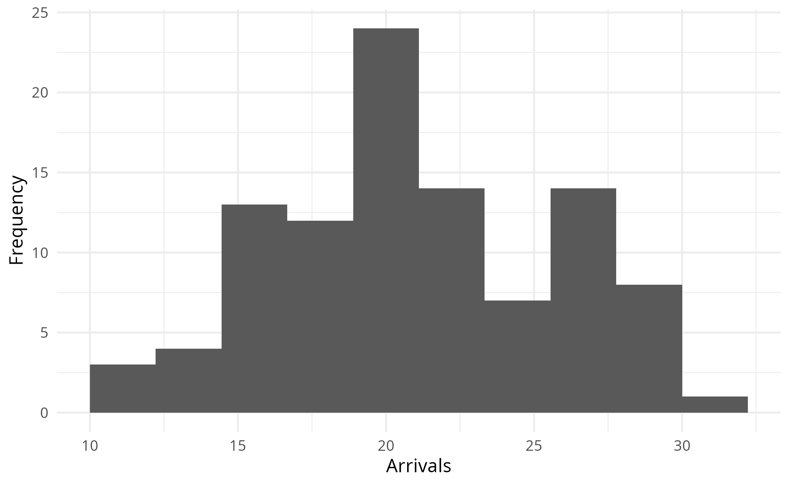
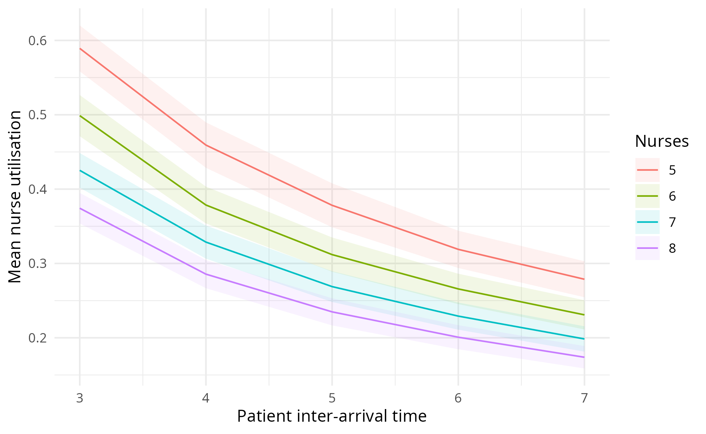
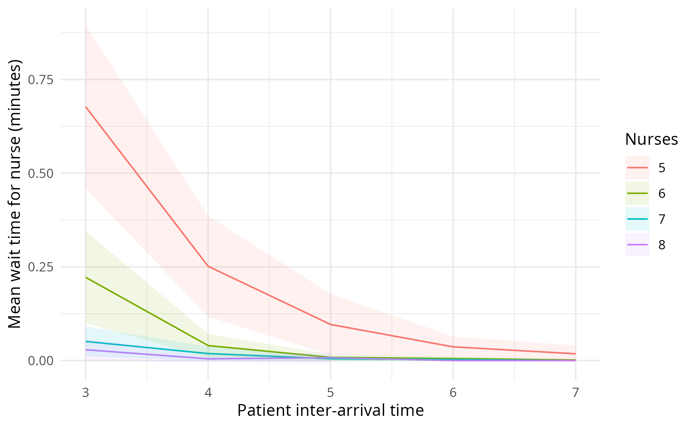
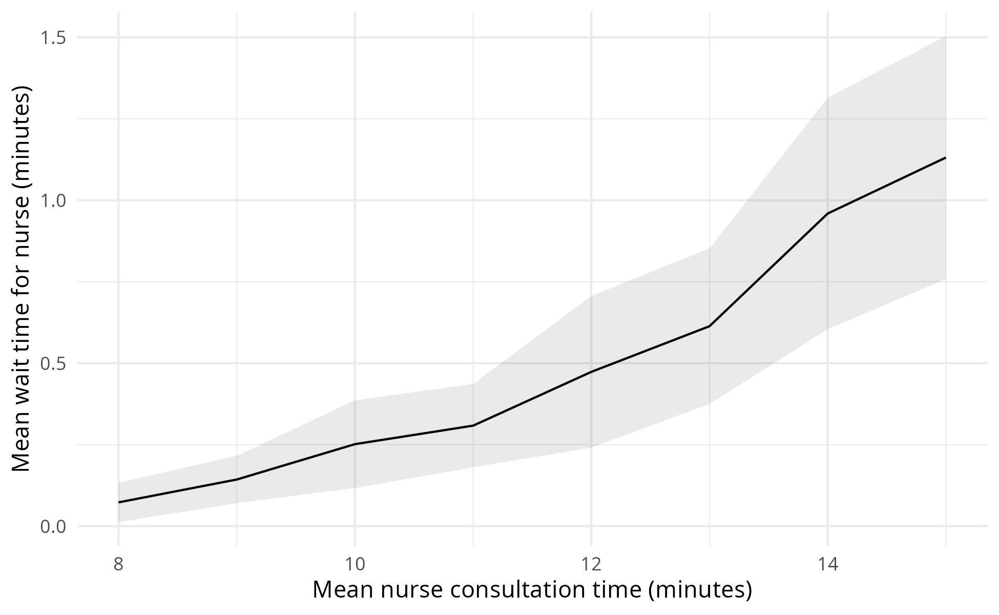
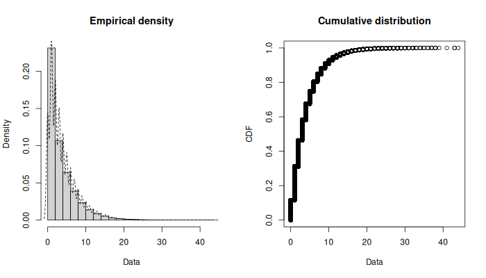
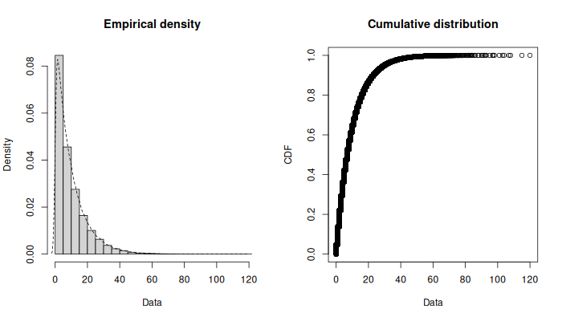
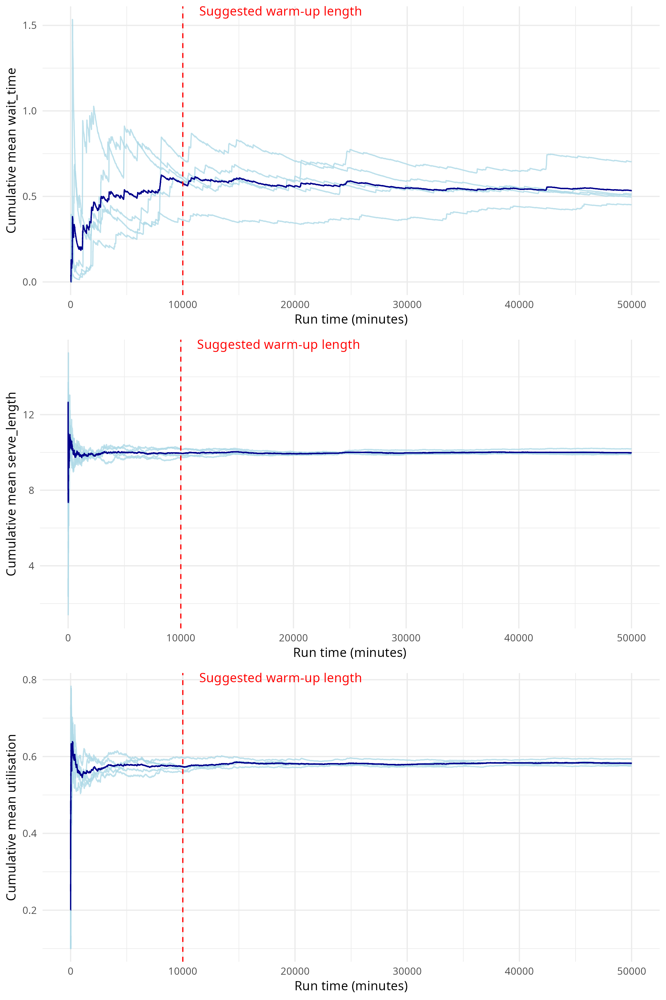
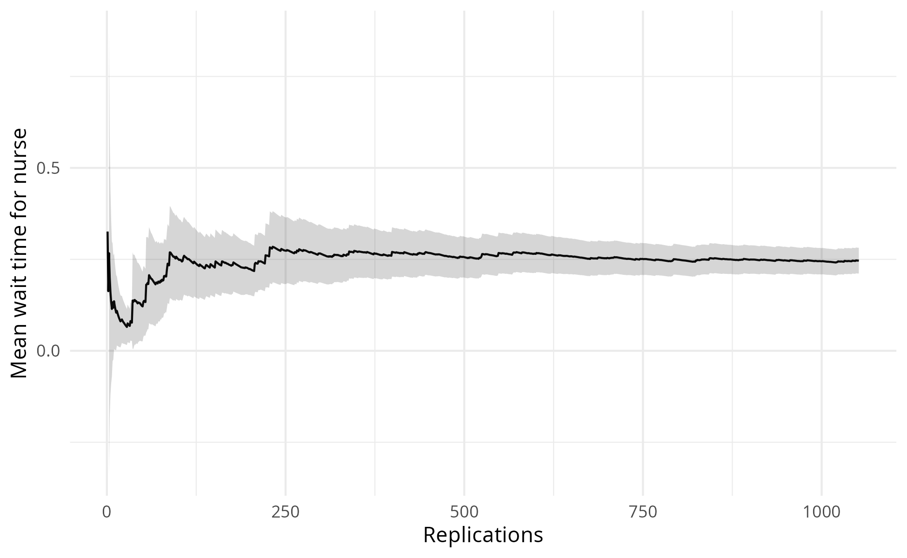
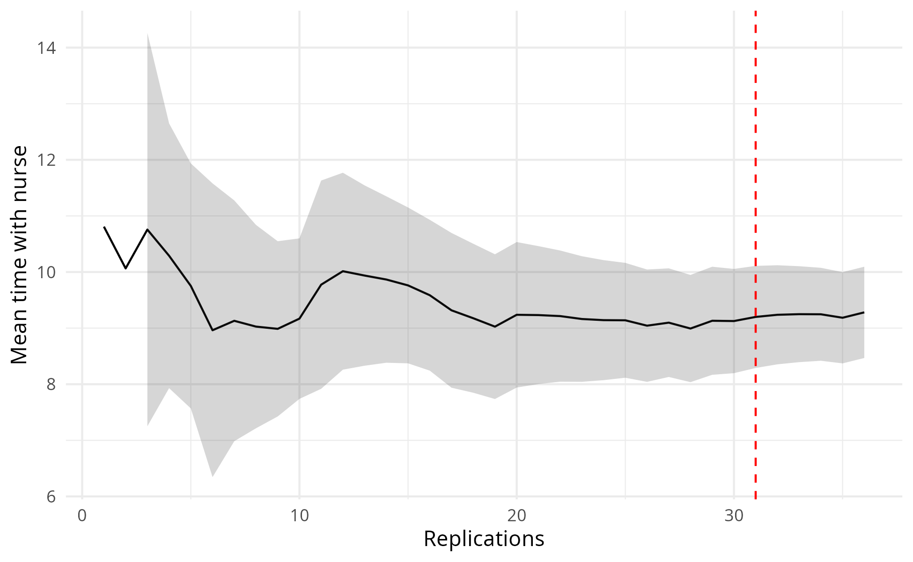
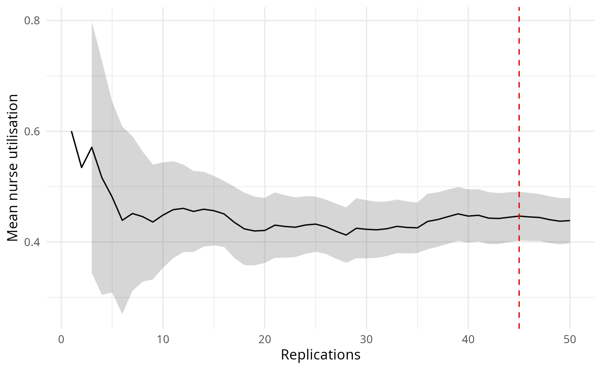

# Mock paper

This mock paper uses images directly from the latest GitHub, so is not stated as being linked to a specific version of the code, like a typical publication.

## Introduction

Lorem ipsum dolor sit amet, consectetur adipiscing elit. Nunc ornare metus vel arcu tincidunt, ut viverra elit vulputate. Aenean et gravida ex. Cras arcu orci, pharetra vitae pulvinar sed, molestie quis augue. Maecenas mattis nulla a mauris vestibulum, vel auctor erat blandit. Curabitur et purus varius, rhoncus felis mattis, sollicitudin est. Orci varius natoque penatibus et magnis dis parturient montes, nascetur ridiculus mus. Nullam vitae nunc ac metus cursus pharetra.

Nunc nisi sem, congue sed risus nec, aliquam molestie tortor. Pellentesque imperdiet metus in velit eleifend convallis. Maecenas tincidunt consequat urna eget dignissim. Quisque porta lorem eget elit mattis, sit amet sollicitudin quam pharetra. Donec dapibus lacus leo, sit amet ornare lacus accumsan nec. Maecenas eu nunc nec purus sollicitudin gravida. Nunc non lobortis eros, id rhoncus arcu.

## Methods

Nam dui enim, porttitor eget tempus ut, placerat at lacus. Mauris ut mauris eu diam egestas tempus. Donec felis neque, iaculis et orci sit amet, finibus aliquam odio. Suspendisse potenti. Etiam urna risus, aliquet eget bibendum eget, tristique sit amet risus. Nunc dolor velit, ultrices eu luctus ac, facilisis pellentesque sapien. Curabitur at sapien ex. Nam accumsan mi sem, venenatis maximus justo mattis vel. Vestibulum a urna in leo facilisis mattis lacinia ac augue.

## Results

Nunc massa sapien, congue eget sapien mattis, maximus condimentum libero. Etiam ac eros vitae diam convallis laoreet. Nam porttitor interdum auctor. Aenean sit amet elit fringilla, lobortis sapien a, interdum enim. Nullam eget erat a diam sollicitudin congue. Phasellus et cursus ipsum. Aliquam laoreet imperdiet dolor vitae gravida. Maecenas bibendum justo nunc, vitae venenatis purus malesuada a. Sed augue est, porta ac sem sit amet, interdum rutrum erat. Class aptent taciti sociosqu ad litora torquent per conubia nostra, per inceptos himenaeos. Phasellus ante justo, consequat ullamcorper mauris et, malesuada maximus nisl. Nulla eget diam non arcu accumsan rutrum. Aenean et eleifend leo. Cras facilisis laoreet erat a efficitur. Duis tempus rutrum ornare.

Vestibulum pharetra tristique porta. Vivamus finibus pharetra purus eu malesuada. Class aptent taciti sociosqu ad litora torquent per conubia nostra, per inceptos himenaeos. Pellentesque interdum nisl est. Vestibulum at est convallis, venenatis metus a, pretium arcu. Phasellus luctus nibh felis, eget iaculis eros ornare eget. Duis id pulvinar odio. Ut non purus euismod, euismod sapien at, pharetra quam. Cras mollis turpis nibh, eget finibus quam imperdiet non. Sed placerat, nisl quis posuere sagittis, ante erat dignissim sem, id maximus lorem tortor efficitur nisi.

Nunc at gravida mauris, non euismod augue. Donec a tincidunt ligula, non tincidunt enim. Etiam iaculis augue eu ipsum interdum porta. Nam nec bibendum ante, sed viverra libero. Orci varius natoque penatibus et magnis dis parturient montes, nascetur ridiculus mus. Quisque gravida nunc et tellus tempus, vel fermentum libero venenatis. Sed quis iaculis metus, quis fringilla erat. Donec ornare feugiat lorem fringilla lacinia. Proin non sem bibendum, auctor orci at, hendrerit sapien. Duis eleifend tellus id diam ornare tristique. Phasellus scelerisque eleifend ante luctus ullamcorper. Fusce eget nunc a orci elementum ultrices. Sed consectetur ante et augue semper blandit.

## Discussion

Phasellus hendrerit est ut lacinia auctor. Vestibulum fermentum gravida eleifend. Integer convallis risus sed tempor ullamcorper. Integer vulputate facilisis tellus, a pretium tortor blandit et. Donec a congue dui, nec auctor lacus. Nam eget fringilla ligula, non aliquet urna. Sed rhoncus dapibus tincidunt. Suspendisse ullamcorper nunc at volutpat pulvinar. Sed vitae justo ipsum. Praesent laoreet turpis sem, a semper elit luctus nec. Donec imperdiet orci eu erat pulvinar tempus. Duis mollis dignissim gravida.

Integer efficitur interdum risus, non imperdiet nisi malesuada nec. Vestibulum sapien justo, congue sed augue at, fermentum pulvinar mi. Mauris ullamcorper ex arcu, at sollicitudin purus tristique ac. Praesent a nibh eleifend, porta ante vitae, iaculis quam. Phasellus id dui placerat, egestas enim et, condimentum neque. Donec at justo et ante congue volutpat a quis leo. Cras ac eros a lorem eleifend iaculis.

## Appendices

### Appendix A. Choosing distributions

### Appendix B. Determining length of warm-up period

### Appendix C. Determining appropriate number of replications

