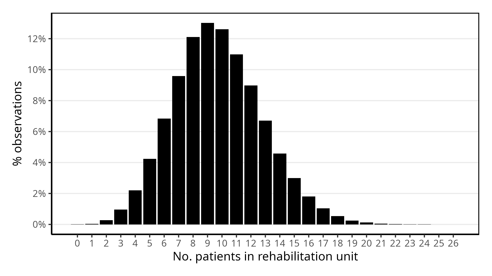

Analysis
================
Amy Heather
2025-07-04

- [Set-up](#set-up)
- [Base case](#base-case)
  - [Run the model](#run-the-model)
  - [Figure 1](#figure-1)
  - [Theory: probability of delay](#theory-probability-of-delay)
  - [Figure 3](#figure-3)
- [Scenario analysis: altering
  arrivals](#scenario-analysis-altering-arrivals)
  - [Scenario 1](#scenario-1)
  - [Table 2](#table-2)
  - [Scenario 4](#scenario-4)
  - [Supplementary table 1](#supplementary-table-1)
- [Scenario analysis: pooling beds](#scenario-analysis-pooling-beds)
  - [Scenario 2](#scenario-2)
  - [Scenario 3](#scenario-3)
  - [Table 3](#table-3)
- [Calculate run time](#calculate-run-time)

This analysis reproduces the analysis performed in:

> Monks T, Worthington D, Allen M, Pitt M, Stein K, James MA. A
> modelling tool for capacity planning in acute and community stroke
> services. BMC Health Serv Res. 2016 Sep 29;16(1):530. doi:
> 10.1186/s12913-016-1789-4. PMID: 27688152; PMCID: PMC5043535.

It is organised into:

- Set-up
- Base case
  - Run the model
  - Figure 1
  - Theory: probability of delay
  - Figure 3
- Scenario analysis: altering arrivals
  - Scenario 1
  - Table 2
  - Scenario 4
  - Supplementary table 1
- Scenario analysis: pooling beds
  - Theory: pooling beds
  - Scenario 2

The generated images are saved and then loaded, so that we view the
image as saved (i.e. with the dimensions set in `ggsave()`). This also
avoids the creation of a `_files/` directory when knitting the document
(which would save all previewed images into that folder also, so they
can be rendered and displayed within the output `.md` file, even if we
had not specifically saved them). These are viewed using
`include_graphics()`, which must be the last command in the cell (or
last in the plotting function).

## Set-up

Install the latest version of the local simulation package. If running
sequentially, `devtools::load_all()` is sufficient. If running in
parallel, you must use `devtools::install()`.

``` r
devtools::install(upgrade = "never")
```

    ## ── R CMD build ─────────────────────────────────────────────────────────────────
    ##      checking for file ‘/home/amy/Documents/stars/rdesrap_stroke/DESCRIPTION’ ...  ✔  checking for file ‘/home/amy/Documents/stars/rdesrap_stroke/DESCRIPTION’
    ##   ─  preparing ‘simulation’:
    ##    checking DESCRIPTION meta-information ...  ✔  checking DESCRIPTION meta-information
    ##   ─  checking for LF line-endings in source and make files and shell scripts
    ##   ─  checking for empty or unneeded directories
    ##      Removed empty directory ‘simulation/tests’
    ##      Omitted ‘LazyData’ from DESCRIPTION
    ##   ─  building ‘simulation_0.1.0.tar.gz’
    ##      
    ## Running /opt/R/4.4.1/lib/R/bin/R CMD INSTALL \
    ##   /tmp/RtmpkX8xAD/simulation_0.1.0.tar.gz --install-tests 
    ## * installing to library ‘/home/amy/.cache/R/renv/library/rdesrap_stroke-34041c45/linux-ubuntu-noble/R-4.4/x86_64-pc-linux-gnu’
    ## * installing *source* package ‘simulation’ ...
    ## ** using staged installation
    ## ** R
    ## ** byte-compile and prepare package for lazy loading
    ## ** help
    ## *** installing help indices
    ## ** building package indices
    ## ** testing if installed package can be loaded from temporary location
    ## ** testing if installed package can be loaded from final location
    ## ** testing if installed package keeps a record of temporary installation path
    ## * DONE (simulation)

``` r
# nolint start: undesirable_function_linter
# Import required packages.
library(dplyr, warn.conflicts = FALSE)
library(ggplot2)
library(knitr)
library(purrr)
library(R6)
library(scales)
```

    ## 
    ## Attaching package: 'scales'

    ## The following object is masked from 'package:purrr':
    ## 
    ##     discard

``` r
library(simulation)
library(stringr)
# nolint end
```

``` r
start_time <- Sys.time()
```

``` r
output_dir <- file.path("..", "outputs")
cores <- 9L
```

## Base case

### Run the model

``` r
param <- create_parameters(cores = cores)
base_results <- runner(param = param)
```

``` r
base_occ <- base_results[["occupancy_stats"]]
```

### Figure 1

**Figure 1**. Simulation probability density function for occupancy of
an acute stroke unit.

``` r
#' Plot the frequency at which each occupancy level was observed in the audit.
#'
#' @param df Data frame. Output from \code{get_occupancy_stats()} containing
#' the frequency each occupancy was observed at.
#' @param unit String. Name of the unit ("asu" | "rehab").
#' @param file String. Filename to save the figure to (e.g. "figure.png").
#' @param path String. Path to save file to (excluding filename).

plot_occupancy_freq <- function(df, unit, file, path = output_dir) {
  # Get label axis
  if (unit == "asu") {
    unit_lab <- "acute"
  } else if (unit == "rehab") {
    unit_lab <- "rehabilitation"
  } else {
    stop("unit must be either 'acute' or 'rehab'", call. = FALSE)
  }

  # Create plot
  p <- ggplot(df, aes(x = .data[["beds"]], y = .data[["pct"]])) +
    geom_bar(stat = "identity", fill = "black") +
    scale_x_continuous(breaks = seq(min(df$beds), max(df$beds), by = 1L)) +
    scale_y_continuous(
      breaks = seq(0L, 1L, by = 0.02),
      labels = scales::percent_format(accuracy = 1L)
    ) +
    labs(
      x = paste("No. patients in", unit_lab, "unit"),
      y = "% observations"
    ) +
    theme_bw(base_size = 14L) +
    theme(
      panel.border = element_rect(colour = "black", fill = NA, linewidth = 1L),
      axis.line = element_line(colour = "black"),
      plot.margin = margin(15L, 15L, 15L, 15L),
      panel.grid.minor.y = element_blank(),
      panel.grid.major.x = element_blank(),
      panel.grid.minor.x = element_blank()
    )

  # Save figure
  if (!dir.exists(path)) dir.create(path, recursive = TRUE)
  full_path <- file.path(output_dir, file)
  ggsave(filename = full_path, plot = p,
         width = 8L, height = 4.5, units = "in", dpi = 300L)

  # View the plot
  include_graphics(full_path)
}
```

**Generate plots…**

(The article just includes a plot for the acute stroke unit).

``` r
plot_occupancy_freq(
  df = base_occ[["asu_bed"]], unit = "asu", file = "figure1_asu.png"
)
```

<!-- -->

``` r
plot_occupancy_freq(
  df = base_occ[["rehab_bed"]], unit = "rehab", file = "figure1_rehab.png"
)
```

<!-- -->

### Theory: probability of delay

We can use our frequency and cumulative frequency of occupied beds from
the simulation to calculate blocking probability.

For example:

| Beds | `pct` | `c_pct` | Probability of delay |
|------|-------|---------|----------------------|
| 0    | 0.2   | 0.2     | 1.0                  |
| 1    | 0.3   | 0.5     | 0.6                  |
| 2    | 0.4   | 0.9     | 0.44                 |
| 3    | 0.1   | 1.0     | 0.1                  |

We can interpret…

- `pct` as the probability of having exactly x beds occupied.
- `c_pct` as the probability of having x or fewer beds occupied.

We can then calculate `pct/c_pct`, which is the probability of delay
when the system has exactly x beds occupied.

Interpretation for 1 bed:

- If we **randomly select a day when the occupancy is 1 or fewer beds**,
  there’s a **60%** chance that the occupancy will be **exactly 1 beds
  (rather than 0 beds)**.

This can then be connected to the probability of delay by thinking about
system capacity:

- If we assume that the unit has a total of 1 beds, then when 1 beds are
  occupied, the unit is at **full capacity**.
- Any new patients arriving when 1 beds are occupied would experience a
  delay.
- So 0.6 represents the probability that, given we’re at or below
  capacity (0 or 1 beds), we’re actually at full capacity (1 beds)

In other words, `pct/c_pct` is the probability that a new arrival will
experience a delay when the system has exactly x beds occupied, given
that the capacity of the system is x beds.

### Figure 3

**Figure 3**. Simulated trade-off between the probability that a patient
is delayed and the no. of acute beds available.

``` r
#' Plot the simulated trade-off between the probability of delay and the
#' number of beds available.
#'
#' @param df Data frame. Should contain columns \code{beds} and
#' \code{prob_delay}.
#' @param unit String. Name of the unit ("asu" | "rehab").
#' @param file String. Filename to save the figure to (e.g. "figure.png").
#' @param path String. Path to save file to (excluding filename).

plot_delay_prob <- function(df, unit, file, path = output_dir) {
  # Axis label
  if (unit == "asu") {
    unit_lab <- "acute"
  } else if (unit == "rehab") {
    unit_lab <- "rehabilitation"
  } else {
    stop("unit must be either 'acute' or 'rehab'", call. = FALSE)
  }

  # Create step plot
  p <- ggplot(df, aes(x = .data[["beds"]], y = .data[["prob_delay"]])) +
    geom_step(direction = "hv", color = "black", linewidth = 1L) +
    scale_x_continuous(
      breaks = seq(min(df$beds), max(df$beds), by = 1L),
      expand = expansion(mult = c(0L, 0.01))
    ) +
    scale_y_continuous(
      breaks = seq(0L, 1L, by = 0.1),
      limits = c(0L, 1L),
      expand = c(0L, 0L)
    ) +
    labs(
      x = paste("No. of", unit_lab, "beds available"),
      y = "Probability of delay"
    ) +
    theme_bw(base_size = 14L) +
    theme(
      panel.border = element_rect(colour = "black", fill = NA, linewidth = 1L),
      axis.line = element_line(colour = "black"),
      plot.margin = margin(15L, 15L, 15L, 15L),
      panel.grid.minor = element_blank()
    )

  # Save figure
  if (!dir.exists(path)) dir.create(path, recursive = TRUE)
  full_path <- file.path(output_dir, file)
  ggsave(filename = full_path, plot = p,
         width = 8L, height = 4.5, units = "in", dpi = 300L)

  # View the plot
  include_graphics(full_path)
}
```

``` r
plot_delay_prob(base_occ[["asu_bed"]], unit = "asu", file = "figure3_asu.png")
```

<!-- -->

``` r
plot_delay_prob(
  base_occ[["rehab_bed"]], unit = "rehab", file = "figure3_rehab.png"
)
```

<!-- -->

## Scenario analysis: altering arrivals

### Scenario 1

**5% more admissions.** A 5% increase in admissions across all patient
subgroups.

``` r
s1_param <- create_parameters(
  asu_arrivals = lapply(create_asu_arrivals(), FUN = function(x) x * 0.95),
  rehab_arrivals = lapply(create_rehab_arrivals(), FUN = function(x) x * 0.95),
  cores = cores
)
print(s1_param$asu_arrivals)
```

    ## $stroke
    ## [1] 1.14
    ## 
    ## $tia
    ## [1] 8.835
    ## 
    ## $neuro
    ## [1] 3.42
    ## 
    ## $other
    ## [1] 3.04

``` r
print(s1_param$rehab_arrivals)
```

    ## $stroke
    ## [1] 20.71
    ## 
    ## $neuro
    ## [1] 30.115
    ## 
    ## $other
    ## [1] 27.17

``` r
s1_results <- runner(param = s1_param)
```

### Table 2

**Table 2** Likelihood of delay. Current admissions versus 5% more
admissions.

This table presents results from the base case and scenario 1 for acute
beds 9-14 and rehab beds 10-16.

``` r
#' Create table with the probability of delay and 1 in n patients delayed,
#' for the base case and a provided scenario.
#'
#' @param scenario A named list containing two data frames:
#'   \code{asu_bed} and \code{rehab_bed}. Each data frame contains simulation
#'   results for the scenario, with columns including \code{beds},
#'   \code{prob_delay}, and \code{1_in_n_delay}.
#' @param scenario_name A character string. The label to use for the scenario
#'   in the output table.
#' @param base A named list containing two data frames: \code{asu_bed} and
#'   \code{rehab_bed}. Each data frame contains simulation results for the base
#'   case, with columns including \code{beds}, \code{prob_delay}, and
#'   \code{1_in_n_delay}.
#' @param base_name A character string. The label to use for the base case in
#'   the output table.
#' @param asu_beds An integer vector of ASU bed numbers to include in the
#'   summary.
#' @param rehab_beds An integer vector of rehabilitation unit bed numbers to
#'   include in the summary.
#'
#' @return A data frame summarising, for each unit and bed number, the
#'   probability of delay and "1 in n" delayed for both the base case and
#'   scenario.

make_delay_table <- function(
  scenario, scenario_name, base, base_name, asu_beds, rehab_beds
) {

  # Helper function to process each unit (asu/rehab)
  process_unit <- function(unit_name, unit_beds) {

    # Extract and filter base and scenario data
    base_df <- base[[unit_name]] |>
      filter(beds %in% unit_beds) |>
      select(beds, .data[["prob_delay"]], .data[["1_in_n_delay"]]) |>
      rename_with(~paste0(., "_", base_name),
                  c("prob_delay", "1_in_n_delay"))

    scenario_df <- scenario[[unit_name]] |>
      filter(beds %in% unit_beds) |>
      select(beds, .data[["prob_delay"]], .data[["1_in_n_delay"]]) |>
      rename_with(~paste0(., "_", scenario_name),
                  c("prob_delay", "1_in_n_delay"))

    # Merge base and scenario on beds
    inner_join(base_df, scenario_df, by = "beds") |>
      mutate(unit = unit_name) |>
      relocate(unit)
  }

  # Process both units
  asu_table <- process_unit("asu_bed", asu_beds)
  rehab_table <- process_unit("rehab_bed", rehab_beds)

  # Combine and return
  bind_rows(asu_table, rehab_table) |>
    arrange(unit, beds)
}
```

``` r
full_tab2 <- make_delay_table(
  scenario = s1_results[["occupancy_stats"]], scenario_name = "5%",
  base = base_occ, base_name = "current",
  asu_beds = 9L:14L, rehab_beds = 10L:16L
)
```

    ## Warning: Use of .data in tidyselect expressions was deprecated in tidyselect 1.2.0.
    ## ℹ Please use `all_of(var)` (or `any_of(var)`) instead of `.data[[var]]`
    ## This warning is displayed once every 8 hours.
    ## Call `lifecycle::last_lifecycle_warnings()` to see where this warning was
    ## generated.

``` r
full_tab2
```

    ##         unit beds prob_delay_current 1_in_n_delay_current prob_delay_5%
    ## 1    asu_bed    9         0.17854708                    6    0.20351586
    ## 2    asu_bed   10         0.12734437                    8    0.14880789
    ## 3    asu_bed   11         0.08693678                   12    0.10511541
    ## 4    asu_bed   12         0.05695960                   18    0.06988273
    ## 5    asu_bed   13         0.03474674                   29    0.04472677
    ## 6    asu_bed   14         0.02058911                   49    0.02772118
    ## 7  rehab_bed   10         0.19622138                    5    0.22129407
    ## 8  rehab_bed   11         0.14545934                    7    0.16882216
    ## 9  rehab_bed   12         0.10520497                   10    0.12584371
    ## 10 rehab_bed   13         0.07343142                   14    0.09036798
    ## 11 rehab_bed   14         0.04806552                   21    0.06227361
    ## 12 rehab_bed   15         0.03090076                   32    0.03990874
    ## 13 rehab_bed   16         0.01838144                   54    0.02466528
    ##    1_in_n_delay_5%
    ## 1                5
    ## 2                7
    ## 3               10
    ## 4               14
    ## 5               22
    ## 6               36
    ## 7                5
    ## 8                6
    ## 9                8
    ## 10              11
    ## 11              16
    ## 12              25
    ## 13              41

These are some adjustments to how table is presented in article (hiding
/ dropping some results)…

``` r
# Round probability columns
adj_full_tab_2 <- full_tab2 |>
  mutate(unit = str_replace(unit, "^asu_bed$", "asu"),
         unit = str_replace(unit, "^rehab_bed$", "rehab"),
         # Round to 2 d.p.
         prob_delay_current = round(prob_delay_current, 2L),
         `prob_delay_5%` = round(`prob_delay_5%`, 2L),
         # Set specified results to NA
         `prob_delay_5%` = ifelse(
           (unit == "asu" & beds == 9L) |
             (unit == "rehab" & beds == 10L), NA, `prob_delay_5%`
         ),
         `1_in_n_delay_5%` = ifelse(
           (unit == "asu" & beds == 9L) |
             (unit == "rehab" & beds == 10L), NA, `1_in_n_delay_5%`
         )) |>
  # Drop rehab 11 beds row
  filter(!(unit == "rehab" & beds == 11L))

# Display and save
print(adj_full_tab_2)
```

    ##     unit beds prob_delay_current 1_in_n_delay_current prob_delay_5%
    ## 1    asu    9               0.18                    6            NA
    ## 2    asu   10               0.13                    8          0.15
    ## 3    asu   11               0.09                   12          0.11
    ## 4    asu   12               0.06                   18          0.07
    ## 5    asu   13               0.03                   29          0.04
    ## 6    asu   14               0.02                   49          0.03
    ## 7  rehab   10               0.20                    5            NA
    ## 8  rehab   12               0.11                   10          0.13
    ## 9  rehab   13               0.07                   14          0.09
    ## 10 rehab   14               0.05                   21          0.06
    ## 11 rehab   15               0.03                   32          0.04
    ## 12 rehab   16               0.02                   54          0.02
    ##    1_in_n_delay_5%
    ## 1               NA
    ## 2                7
    ## 3               10
    ## 4               14
    ## 5               22
    ## 6               36
    ## 7               NA
    ## 8                8
    ## 9               11
    ## 10              16
    ## 11              25
    ## 12              41

``` r
write.csv(adj_full_tab_2, file.path(output_dir, "table2.csv"))
```

### Scenario 4

**No complex-neurological cases.** Complex neurological patients are
excluded from the pathway in order to assess their impact on bed
requirements.

``` r
# Set IAT very high, essentially meaning that we have no neuro arrivals
s4_param <- create_parameters(
  asu_arrivals = create_asu_arrivals(neuro = 10000000000),
  rehab_arrivals = create_rehab_arrivals(neuro = 10000000000),
  cores = 9L
)
```

``` r
s4_results <- runner(param = s4_param)
```

### Supplementary table 1

**Supplementary Table 1.** Likelihood of delay. Current admissions
versus No Complex neurological patients.

``` r
sup_tab1 <- make_delay_table(
  scenario = s4_results[["occupancy_stats"]], scenario_name = "5%",
  base = base_occ, base_name = "current",
  asu_beds = 10L:15L, rehab_beds = 12L:16L
)
sup_tab1
```

    ##         unit beds prob_delay_current 1_in_n_delay_current prob_delay_5%
    ## 1    asu_bed   10         0.12734437                    8   0.082113405
    ## 2    asu_bed   11         0.08693678                   12   0.050599363
    ## 3    asu_bed   12         0.05695960                   18   0.029293265
    ## 4    asu_bed   13         0.03474674                   29   0.016426895
    ## 5    asu_bed   14         0.02058911                   49   0.008443345
    ## 6    asu_bed   15         0.01150236                   87   0.004363680
    ## 7  rehab_bed   12         0.10520497                   10   0.050456434
    ## 8  rehab_bed   13         0.07343142                   14   0.030113274
    ## 9  rehab_bed   14         0.04806552                   21   0.017495353
    ## 10 rehab_bed   15         0.03090076                   32   0.009258279
    ## 11 rehab_bed   16         0.01838144                   54   0.004591844
    ##    1_in_n_delay_5%
    ## 1               12
    ## 2               20
    ## 3               34
    ## 4               61
    ## 5              118
    ## 6              229
    ## 7               20
    ## 8               33
    ## 9               57
    ## 10             108
    ## 11             218

## Scenario analysis: pooling beds

### Scenario 2

Scenario 2: **Pooling of acute and rehab beds.** The acute and rehab
wards are co-located at same site. Beds are pooled and can be used by
either acute or rehabilitation patients. Pooling of the total bed stock
of 22 is compared to the pooling of an increased bed stock of 26.

``` r
# Calculate the combined occupancy from each timepoint in the audit
pooled_results <- base_results[["occupancy"]] |>
  group_by(time, replication) |>
  summarise(occupancy = sum(occupancy)) |>
  ungroup() |>
  mutate(resource = "pooled")
```

    ## `summarise()` has grouped output by 'time'. You can override using the
    ## `.groups` argument.

``` r
# Calculate occupancy statistics
pooled_occ <- get_occupancy_stats(pooled_results)[["pooled"]]
pooled_occ
```

    ##    beds  freq          pct        c_pct   prob_delay 1_in_n_delay
    ## 1     0   178 4.062536e-04 0.0004062536 1.000000e+00            1
    ## 2     1    93 2.122561e-04 0.0006185096 3.431734e-01            3
    ## 3     2   113 2.579025e-04 0.0008764122 2.942708e-01            3
    ## 4     3   179 4.085359e-04 0.0012849481 3.179396e-01            3
    ## 5     4   211 4.815702e-04 0.0017665183 2.726098e-01            4
    ## 6     5   287 6.550268e-04 0.0024215451 2.704995e-01            4
    ## 7     6   586 1.337442e-03 0.0037589866 3.557984e-01            3
    ## 8     7  1154 2.633801e-03 0.0063927879 4.119957e-01            2
    ## 9     8  2207 5.037088e-03 0.0114298756 4.406949e-01            2
    ## 10    9  4279 9.766062e-03 0.0211959375 4.607516e-01            2
    ## 11   10  7286 1.662901e-02 0.0378249458 4.396307e-01            2
    ## 12   11 11642 2.657081e-02 0.0643957549 4.126174e-01            2
    ## 13   12 17275 3.942714e-02 0.1038228917 3.797538e-01            3
    ## 14   13 23059 5.262810e-02 0.1564509871 3.363871e-01            3
    ## 15   14 29581 6.751341e-02 0.2239643958 3.014471e-01            3
    ## 16   15 35350 8.068013e-02 0.3046445281 2.648337e-01            4
    ## 17   16 39210 8.948990e-02 0.3941344288 2.270543e-01            4
    ## 18   17 40437 9.229031e-02 0.4864247404 1.897319e-01            5
    ## 19   18 39865 9.098482e-02 0.5774095629 1.575742e-01            6
    ## 20   19 37819 8.631519e-02 0.6637247518 1.300467e-01            8
    ## 21   20 34068 7.775419e-02 0.7414789456 1.048637e-01           10
    ## 22   21 28943 6.605729e-02 0.8075362319 8.180102e-02           12
    ## 23   22 23521 5.368253e-02 0.8612187607 6.233321e-02           16
    ## 24   23 18251 4.165468e-02 0.9028734452 4.613568e-02           22
    ## 25   24 13526 3.087071e-02 0.9337441515 3.306120e-02           30
    ## 26   25  9948 2.270455e-02 0.9564487048 2.373839e-02           42
    ## 27   26  6744 1.539199e-02 0.9718406938 1.583798e-02           63
    ## 28   27  4567 1.042337e-02 0.9822640648 1.061158e-02           94
    ## 29   28  2942 6.714595e-03 0.9889786603 6.789424e-03          147
    ## 30   29  1894 4.322721e-03 0.9933013808 4.351872e-03          230
    ## 31   30  1136 2.592719e-03 0.9958941002 2.603409e-03          384
    ## 32   31   728 1.661531e-03 0.9975556316 1.665603e-03          600
    ## 33   32   440 1.004222e-03 0.9985598539 1.005671e-03          994
    ## 34   33   226 5.158051e-04 0.9990756590 5.162823e-04         1937
    ## 35   34   139 3.172430e-04 0.9993929020 3.174357e-04         3150
    ## 36   35    87 1.985621e-04 0.9995914641 1.986433e-04         5034
    ## 37   36    62 1.415041e-04 0.9997329682 1.415418e-04         7065
    ## 38   37    39 8.901061e-05 0.9998219788 8.902646e-05        11233
    ## 39   38    26 5.934041e-05 0.9998813192 5.934745e-05        16850
    ## 40   39    18 4.108182e-05 0.9999224010 4.108501e-05        24340
    ## 41   40    10 2.282323e-05 0.9999452242 2.282448e-05        43813
    ## 42   41     3 6.846970e-06 0.9999520712 6.847298e-06       146043
    ## 43   42     4 9.129294e-06 0.9999612005 9.129648e-06       109533
    ## 44   43     8 1.825859e-05 0.9999794591 1.825896e-05        54768
    ## 45   44     2 4.564647e-06 0.9999840237 4.564720e-06       219071
    ## 46   45     1 2.282323e-06 0.9999863061 2.282355e-06       438144
    ## 47   46     1 2.282323e-06 0.9999885884 2.282349e-06       438145
    ## 48   47     0 0.000000e+00 0.9999885884 0.000000e+00          Inf
    ## 49   48     1 2.282323e-06 0.9999908707 2.282344e-06       438146
    ## 50   49     1 2.282323e-06 0.9999931530 2.282339e-06       438147
    ## 51   50     2 4.564647e-06 0.9999977177 4.564657e-06       219074
    ## 52   51     1 2.282323e-06 1.0000000000 2.282323e-06       438150

Get probability of delay and 1 in every n patients delayed from 22 and
26 pooled beds, to use in Table 3 below.

``` r
pdelay_pooling_22 <- pooled_occ$prob_delay[pooled_occ$beds == 22L]
npatients_pooling_22 <- pooled_occ$`1_in_n_delay`[pooled_occ$beds == 22L]
print(pdelay_pooling_22)
```

    ## [1] 0.06233321

``` r
print(npatients_pooling_22)
```

    ## [1] 16

``` r
pdelay_pooling_26 <- pooled_occ$prob_delay[pooled_occ$beds == 26L]
npatients_pooling_26 <- pooled_occ$`1_in_n_delay`[pooled_occ$beds == 26L]
print(pdelay_pooling_26)
```

    ## [1] 0.01583798

``` r
print(npatients_pooling_26)
```

    ## [1] 63

### Scenario 3

Scenario 3: **Partial pooling of acute and rehab beds.** The acute and
rehab wards are co-located at same site. A subset of the 26 beds are
pooled and can be used by either acute or rehab patients.

``` r
#' @title PooledDelay class.
#'
#' @field asu ASU occupancy frequencies as named numeric vector.
#' @field rehab Rehab occupancy frequencies as named numeric vector.
#' @field asu_beds Number of dedicated ASU beds (excluding pooled beds).
#' @field rehab_beds Number of dedicated rehab beds (excluding pooled beds).
#' @field pooled_beds Number of beds that can be used by either unit.

PooledDelay <- R6Class( # nolint: object_name_linter
  classname = "PooledDelay",
  public = list(
    asu = NULL,
    rehab = NULL,
    asu_beds = NULL,
    rehab_beds = NULL,
    pooled_beds = NULL,

    initialize = function(base_occ) {
      # Extract occupancy frequencies as named numeric vectors
      self$asu <- base_occ$asu_bed |>
        tibble::column_to_rownames("beds") |>
        pull(freq) |>
        setNames(base_occ$asu_bed$beds)
      self$rehab <- base_occ$rehab_bed |>
        tibble::column_to_rownames("beds") |>
        pull(freq) |>
        setNames(base_occ$rehab_bed$beds)
    },

    #' Calculate probability of an occupancy condition
    #'
    #' Computes the probability that the occupancy meets a specified condition
    #' (greater than or equal to, equal to, or less than a threshold), given
    #' observed occupancy frequencies.
    #'
    #' @param occ_freq Named numeric vector of occupancy frequencies.
    #' @param threshold Numeric threshold for comparison.
    #' @param comparison Type of comparison: \code{"ge"}, \code{"eq"}, or
    #' \code{"lt"}.
    #'
    #' @return Numeric probability.

    prob_occupancy = function(occ_freq, threshold, comparison) {
      total_freq <- sum(occ_freq)
      # Convert names to numeric for comparison
      occ_vals <- as.numeric(names(occ_freq))

      filtered_freq <- switch(comparison,
        ge = sum(occ_freq[occ_vals >= threshold]),
        eq = sum(occ_freq[occ_vals == threshold]),
        lt = sum(occ_freq[occ_vals < threshold]),
        stop("Comparison '", comparison, "' not valid.", call. = FALSE)
      )
      filtered_freq / total_freq
    },

    #' Calculate the probability of only one unit having delays
    #'
    #' Calculates the probability that only the specified unit (ASU or rehab)
    #' experiences delays, based on current bed allocations.
    #'
    #' @param unit Character. Name of unit to investigate ("asu" or "rehab").
    #'
    #' @return Numeric probability that only the specified unit has delays.

    calculate_only_unit_overflow = function(unit) {
      other_unit <- ifelse(unit == "asu", "rehab", "asu")
      unit_beds_val <- ifelse(unit == "asu", self$asu_beds, self$rehab_beds)
      other_beds_val <- ifelse(
        other_unit == "asu", self$asu_beds, self$rehab_beds
      )

      p_unit <- self$prob_occupancy(
        occ_freq = if (unit == "asu") self$asu else self$rehab,
        threshold = unit_beds_val + self$pooled_beds,
        comparison = "ge"
      )
      p_other <- self$prob_occupancy(
        occ_freq = if (other_unit == "asu") self$asu else self$rehab,
        threshold = other_beds_val,
        comparison = "lt"
      )
      p_unit * p_other
    },

    #' Generate delay combinations for a unit
    #'
    #' Generates a list of combinations representing the number of patients in
    #' each unit that would cause delays, for a given focus unit (ASU or rehab).
    #'
    #' @param unit Character. Name of unit to investigate ("asu" or "rehab").
    #'
    #' @return List of lists, each containing named counts for "asu" and
    #' "rehab".

    get_delay_combinations = function(unit) {
      other_unit <- ifelse(unit == "asu", "rehab", "asu")
      unit_beds_val <- ifelse(unit == "asu", self$asu_beds, self$rehab_beds)
      other_beds_val <- ifelse(
        other_unit == "asu", self$asu_beds, self$rehab_beds
      )
      max_beds <- unit_beds_val + self$pooled_beds

      combos <- lapply(unit_beds_val:max_beds, function(i) {
        combo <- list()
        combo[[unit]] <- i
        combo[[other_unit]] <- max_beds - i + other_beds_val
        combo
      })
      rev(combos)
    },

    #' Calculate probability for a list of combinations
    #'
    #' Calculates the probability that any of a set of combinations (from
    #' \code{get_delay_combinations}) occurs, representing joint occupancy
    #' scenarios that would cause delays.
    #'
    #' @param combination List of lists. Each element is a named list with
    #' "asu" and "rehab" counts.
    #'
    #' @return Numeric probability of any combination occurring.

    calculate_combination_probability = function(combination) {
      probabilities <- numeric(length(combination))
      for (i in seq_along(combination)) {
        combo <- combination[[i]]
        unit_name <- names(combo)[1L]
        other_name <- names(combo)[2L]
        unit_threshold <- combo[[1L]]
        other_threshold <- combo[[2L]]

        unit_occ_freq <- if (unit_name == "asu") self$asu else self$rehab
        other_occ_freq <- if (other_name == "asu") self$asu else self$rehab

        p_unit <- if (i == 1L) {
          self$prob_occupancy(unit_occ_freq, unit_threshold, "ge")
        } else {
          self$prob_occupancy(unit_occ_freq, unit_threshold, "eq")
        }
        p_other <- self$prob_occupancy(other_occ_freq, other_threshold, "ge")
        probabilities[i] <- p_unit * p_other
      }
      sum(probabilities)
    },

    #' Analyse a bed pooling scenario and calculate delay probabilities
    #'
    #' Calculates the probability of delay for acute (ASU) and rehabilitation
    #' units given the specified numbers of dedicated and pooled beds.
    #'
    #' @param asu_beds Number of dedicated ASU beds (excluding pooled beds).
    #' @param rehab_beds Number of dedicated rehabilitation beds (excluding
    #' pooled beds).
    #' @param pooled_beds Number of beds that can be used by either unit.
    #'
    #' @return A list containing:
    #'   \describe{
    #'     \item{\code{dedicated_acute}}{Number of dedicated ASU beds.}
    #'     \item{\code{dedicated_rehab}}{Number of dedicated rehabilitation
    #'     beds.}
    #'     \item{\code{pooled}}{Number of pooled beds.}
    #'     \item{\code{pdelay_acute}}{Probability of delay for ASU patients.}
    #'     \item{\code{pdelay_rehab}}{Probability of delay for rehabilitation
    #'     patients.}
    #'     \item{\code{1_in_n_delay_acute}}{Expected number of ASU patients per
    #'     delay (rounded).}
    #'     \item{\code{1_in_n_delay_rehab}}{Expected number of rehab patients
    #'     per delay (rounded).}
    #'   }

    calculate_delay = function(asu_beds, rehab_beds, pooled_beds) {
      # Update internal state
      self$asu_beds <- asu_beds
      self$rehab_beds <- rehab_beds
      self$pooled_beds <- pooled_beds

      p_asu_only <- self$calculate_only_unit_overflow("asu")
      p_rehab_only <- self$calculate_only_unit_overflow("rehab")

      asu_comb <- self$get_delay_combinations("asu")
      rehab_comb <- self$get_delay_combinations("rehab")

      p_asu_comb <- self$calculate_combination_probability(asu_comb)
      p_rehab_comb <- self$calculate_combination_probability(rehab_comb)

      pdelay_acute <- p_asu_only + p_asu_comb
      pdelay_rehab <- p_rehab_only + p_rehab_comb

      result <- list(
        dedicated_acute = asu_beds,
        dedicated_rehab = rehab_beds,
        pooled = pooled_beds,
        pdelay_acute = round(pdelay_acute, 3L),
        pdelay_rehab = round(pdelay_rehab, 3L),
        `1_in_n_delay_acute` = round(1L / pdelay_acute),
        `1_in_n_delay_rehab` = round(1L / pdelay_rehab)
      )
      result
    }
  )
)
```

Create list with the 22 + 26 pooled bed results

``` r
#' Create a name list representing a pooled result entry
#'
#' @param pooled_value Numeric. The value for the 'pooled' key.
#' @param pdelay_value Numeric. The probability of delay (for acute and rehab).
#' @param npatients_value Numeric. 1 in every n patients delayed (for acute
#' and rehab).
#'
#' @return Named list.
create_pool_result <- function(pooled_value, pdelay_value, npatients_value) {
  list(
    dedicated_acute = 0L,
    dedicated_rehab = 0L,
    pooled = pooled_value,
    pdelay_acute = pdelay_value,
    pdelay_rehab = pdelay_value,
    `1_in_n_delay_acute` = npatients_value,
    `1_in_n_delay_rehab` = npatients_value
  )
}

# Build list
pool_result_list <- list(
  create_pool_result(22L, pdelay_pooling_22, npatients_pooling_22),
  create_pool_result(26L, pdelay_pooling_26, npatients_pooling_26)
)
```

Add result for 14 acute 12 rehab 0 pooled, as in table 2.

``` r
# Extract from table
acute14 <- filter(full_tab2, unit == "asu_bed", beds == 14L)
rehab12 <- filter(full_tab2, unit == "rehab_bed", beds == 12L)

# Add to list
pool_result_list[[length(pool_result_list) + 1L]] <- list(
  dedicated_acute = 14L,
  dedicated_rehab = 12L,
  pooled = 0L,
  pdelay_acute = acute14$prob_delay_current,
  pdelay_rehab = rehab12$prob_delay_current,
  `1_in_n_delay_acute` = acute14$`1_in_n_delay_current`,
  `1_in_n_delay_rehab` = rehab12$`1_in_n_delay_current`
)
```

Calculate results from other pooling scenarios using the `PooledDelay`
class and add to the list, then display as a dataframe.

``` r
# Create pooled_delay object
pooled_delay <- PooledDelay$new(base_occ = base_results[["occupancy_stats"]])

# Loop through scenarios
scenarios <- list(
  c(11L, 11L, 4L), c(11L, 10L, 5L), c(10L, 10L, 6L),
  c(10L, 9L, 7L), c(9L, 9L, 8L), c(9L, 8L, 9L)
)
for (beds in scenarios) {
  pool_result_list[[length(pool_result_list) + 1L]] <- (
    pooled_delay$calculate_delay(
      asu_beds = beds[1L], rehab_beds = beds[2L], pooled_beds = beds[3L]
    )
  )
}
```

### Table 3

``` r
# Convert the list of lists to a data.frame
tab3 <- do.call(rbind, lapply(pool_result_list, as.data.frame)) |>
  mutate(pdelay_acute = round(pdelay_acute, 3L),
         pdelay_rehab = round(pdelay_rehab, 3L)) |>
  rename_with(~ sub("^X", "", .),
              .cols = c("X1_in_n_delay_acute", "X1_in_n_delay_rehab"))

# Display the data.frame and save to CSV
print(tab3)
```

    ##   dedicated_acute dedicated_rehab pooled pdelay_acute pdelay_rehab
    ## 1               0               0     22        0.062        0.062
    ## 2               0               0     26        0.016        0.016
    ## 3              14              12      0        0.021        0.105
    ## 4              11              11      4        0.047        0.086
    ## 5              11              10      5        0.040        0.087
    ## 6              10              10      6        0.044        0.064
    ## 7              10               9      7        0.040        0.065
    ## 8               9               9      8        0.043        0.052
    ## 9               9               8      9        0.042        0.053
    ##   1_in_n_delay_acute 1_in_n_delay_rehab
    ## 1                 16                 16
    ## 2                 63                 63
    ## 3                 49                 10
    ## 4                 21                 12
    ## 5                 25                 11
    ## 6                 23                 16
    ## 7                 25                 15
    ## 8                 23                 19
    ## 9                 24                 19

``` r
write.csv(tab3, file = file.path(output_dir, "table3.csv"), row.names = FALSE)
```

## Calculate run time

``` r
# Get run time in seconds
end_time <- Sys.time()
runtime <- as.numeric(end_time - start_time, units = "secs")

# Display converted to minutes and seconds
minutes <- as.integer(runtime / 60L)
seconds <- as.integer(runtime %% 60L)
cat(sprintf("Notebook run time: %dm %ds", minutes, seconds))
```

    ## Notebook run time: 1m 34s
