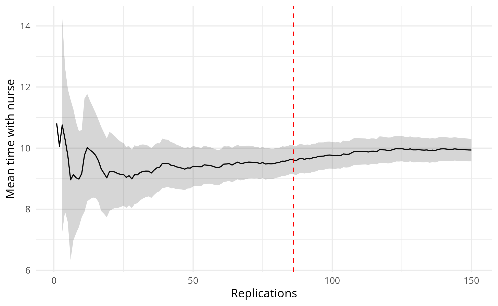
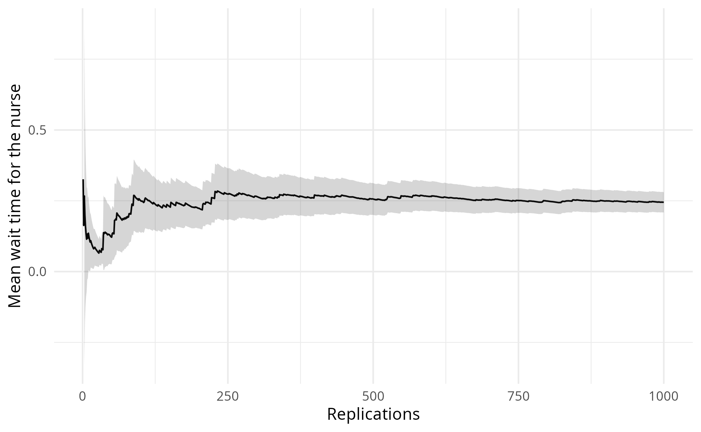
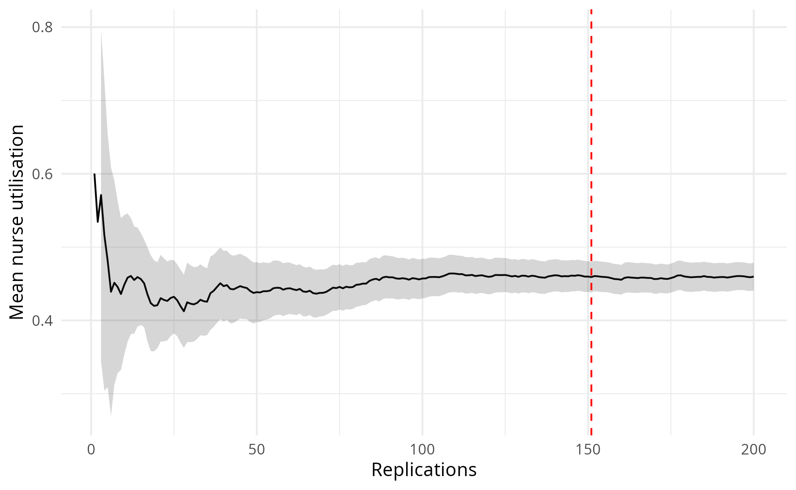
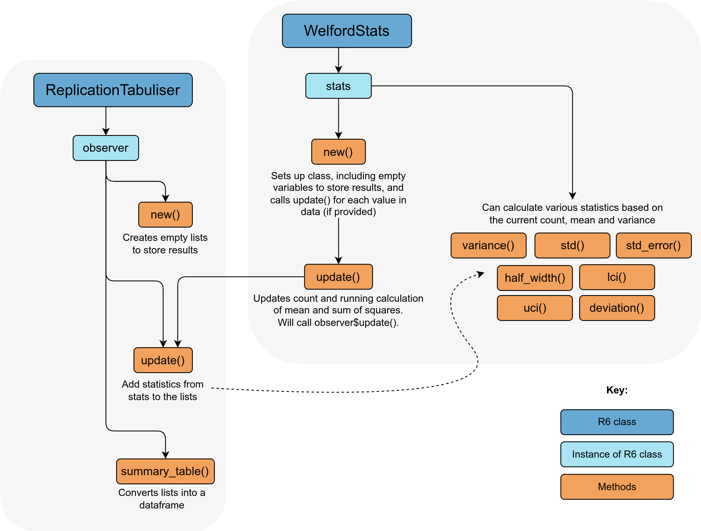
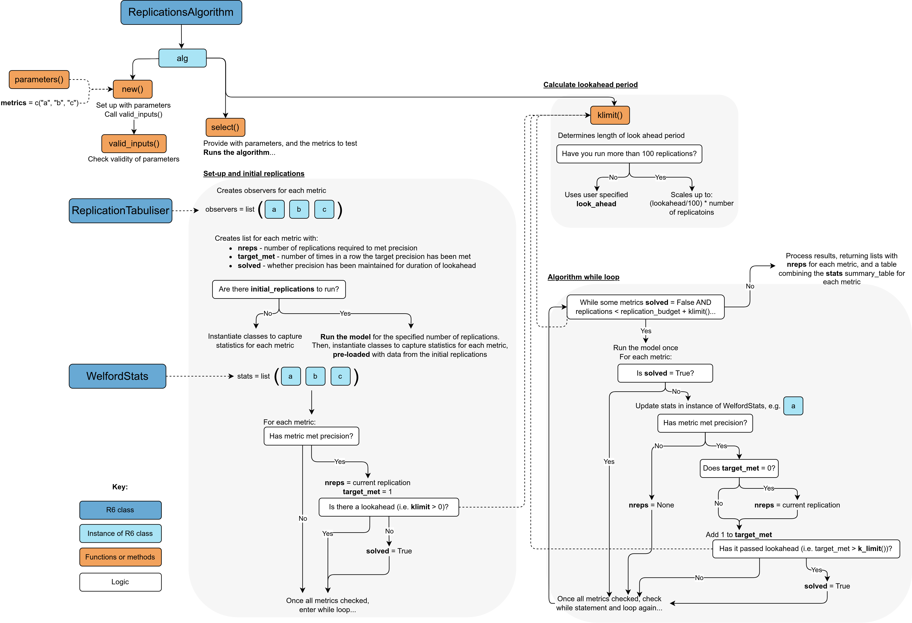

Choosing replications
================
Amy Heather
2025-06-04

- [Set up](#set-up)
- [Choosing the number of
  replications](#choosing-the-number-of-replications)
- [Automated detection of the number of
  replications](#automated-detection-of-the-number-of-replications)
- [Explanation of the automated
  method](#explanation-of-the-automated-method)
  - [WelfordStats](#welfordstats)
  - [ReplicationTabuliser](#replicationtabuliser)
  - [ReplicationsAlgorithm](#replicationsalgorithm)
- [Run time](#run-time)

This notebook documents the choice of the number of replications.

The generated images are saved and then loaded, so that we view the
image as saved (i.e. with the dimensions set in `ggsave()`). This also
avoids the creation of a `_files/` directory when knitting the document
(which would save all previewed images into that folder also, so they
can be rendered and displayed within the output `.md` file, even if we
had not specifically saved them). These are viewed using
`include_graphics()`, which must be the last command in the cell (or
last in the plotting function).

Some of these figures are used in the paper (`mock_paper.md`) - see
below:

- **Figure C.1:** `outputs/reps_algorithm_wait_time.png`
- **Figure C.2:** `outputs/reps_algorithm_serve_time.png`
- **Figure C.3:** `outputs/reps_algorithm_utilisation.png`

The run time is provided at the end of the notebook.

## Set up

Install the latest version of the local simulation package. If running
sequentially, `devtools::load_all()` is sufficient. If running in
parallel, you must use `devtools::install()`.

``` r
devtools::load_all()
```

    ## ℹ Loading simulation

Load required packages.

``` r
# nolint start: undesirable_function_linter.
library(data.table)
library(dplyr)
```

    ## 
    ## Attaching package: 'dplyr'

    ## The following objects are masked from 'package:data.table':
    ## 
    ##     between, first, last

    ## The following object is masked from 'package:testthat':
    ## 
    ##     matches

    ## The following objects are masked from 'package:stats':
    ## 
    ##     filter, lag

    ## The following objects are masked from 'package:base':
    ## 
    ##     intersect, setdiff, setequal, union

``` r
library(knitr)
library(simulation)
library(tidyr)
```

    ## 
    ## Attaching package: 'tidyr'

    ## The following object is masked from 'package:testthat':
    ## 
    ##     matches

``` r
options(data.table.summarise.inform = FALSE)
options(dplyr.summarise.inform = FALSE)
# nolint end
```

Start timer.

``` r
start_time <- Sys.time()
```

Define path to outputs folder.

``` r
output_dir <- file.path("..", "outputs")
```

## Choosing the number of replications

The **confidence interval method** can help you decide how many
replications (runs) your simulation needs. The more replications you
run, the narrower your confidence interval becomes, leading to a more
precise estimate of the model’s mean performance.

There are two main calculations:

- **Confidence interval**. This is the range where the true mean is
  likely to be, based on your simulation results. For example, a 95%
  confidence interval means that, if you repeated the experiment many
  times, about 95 out of 100 intervals would contain the true mean.
- **Precision**. This tells you how close that range is to your mean.
  For example, if your mean is 50 and your 95% confidence interval is 45
  to 55, your precision is ±10% (because 5 is 10% of 50).

To run this method you:

- Run the model with more and more replications.
- Check after each how wide your confidence interval is.
- Stop when the interval is narrow enough to meet your desired
  precision.
- Make sure the interval stays this narrow if you keep running more
  replications.

This method is less useful for values very close to zero - so, for
example, when using utilisation (which ranges from 0 to 1) it is
recommended to multiple values by 100.

When deciding how many replications you need, repeat this process for
each performance measure you care about, and use the largest number you
find.

It’s important to check ahead, to check that the 10% precision is
maintained - which is fine in this case - it doesn’t go back up to
future deviation.

``` r
# Run calculations and produce plot
ci_df <- confidence_interval_method(
  replications = 150L,
  desired_precision = 0.1,
  metric = "mean_serve_time_nurse"
)
```

    ## $patient_inter
    ## [1] 4
    ## 
    ## $mean_n_consult_time
    ## [1] 10
    ## 
    ## $number_of_nurses
    ## [1] 5
    ## 
    ## $warm_up_period
    ## [1] 0
    ## 
    ## $data_collection_period
    ## [1] 80
    ## 
    ## $number_of_runs
    ## [1] 150
    ## 
    ## $scenario_name
    ## NULL
    ## 
    ## $cores
    ## [1] 1
    ## 
    ## $log_to_console
    ## [1] FALSE
    ## 
    ## $log_to_file
    ## [1] FALSE
    ## 
    ## $file_path
    ## NULL

    ## Reached desired precision (0.1) in 31 replications.

``` r
# Preview dataframe
head(ci_df)
```

    ##   replications      data cumulative_mean    stdev lower_ci upper_ci deviation
    ## 1            1 10.808606       10.808606       NA       NA       NA        NA
    ## 2            2  9.319953       10.064280       NA       NA       NA        NA
    ## 3            3 12.141014       10.756525 1.411251 7.250782 14.26227 0.3259178
    ## 4            4  8.889448       10.289755 1.482986 7.929994 12.64952 0.2293312
    ## 5            5  7.603423        9.752489 1.758611 7.568885 11.93609 0.2239022
    ## 6            6  5.009584        8.962005 2.494667 6.344013 11.58000 0.2921212
    ##                  metric
    ## 1 mean_serve_time_nurse
    ## 2 mean_serve_time_nurse
    ## 3 mean_serve_time_nurse
    ## 4 mean_serve_time_nurse
    ## 5 mean_serve_time_nurse
    ## 6 mean_serve_time_nurse

``` r
# View first ten rows where percentage deviation is below 5
ci_df %>%
  filter(deviation < 0.05) %>%
  head(10L)
```

    ##    replications      data cumulative_mean    stdev lower_ci upper_ci  deviation
    ## 1            83  9.371854        9.571474 2.189385 9.093408 10.04954 0.04994690
    ## 2            84 11.420438        9.593485 2.185486 9.119206 10.06776 0.04943768
    ## 3            85 12.854029        9.631845 2.201037 9.157092 10.10660 0.04928989
    ## 4            86  8.139575        9.614493 2.193960 9.144107 10.08488 0.04892468
    ## 5            87  7.425008        9.589326 2.193762 9.121772 10.05688 0.04875777
    ## 6            88 14.565590        9.645875 2.244699 9.170268 10.12148 0.04930671
    ## 7            89 10.722522        9.657972 2.234825 9.187201 10.12874 0.04874429
    ## 8            90  7.670319        9.635887 2.232089 9.168385 10.10339 0.04851676
    ## 9            91 11.396571        9.655235 2.227314 9.191374 10.11910 0.04804240
    ## 10           92  8.807005        9.646015 2.216807 9.186927 10.10510 0.04759352
    ##                   metric
    ## 1  mean_serve_time_nurse
    ## 2  mean_serve_time_nurse
    ## 3  mean_serve_time_nurse
    ## 4  mean_serve_time_nurse
    ## 5  mean_serve_time_nurse
    ## 6  mean_serve_time_nurse
    ## 7  mean_serve_time_nurse
    ## 8  mean_serve_time_nurse
    ## 9  mean_serve_time_nurse
    ## 10 mean_serve_time_nurse

``` r
# Create plot
path <- file.path(output_dir, "conf_int_method_serve_time.png")
plot_replication_ci(
  conf_ints = ci_df,
  yaxis_title = "Mean time with nurse",
  file_path = path,
  min_rep = 86L
)
# View plot
include_graphics(path)
```

<!-- -->

It is also important to check across multiple metrics.

``` r
# Run calculations
ci_df <- confidence_interval_method(
  replications = 1000L,
  desired_precision = 0.1,
  metric = "mean_waiting_time_nurse"
)
```

    ## $patient_inter
    ## [1] 4
    ## 
    ## $mean_n_consult_time
    ## [1] 10
    ## 
    ## $number_of_nurses
    ## [1] 5
    ## 
    ## $warm_up_period
    ## [1] 0
    ## 
    ## $data_collection_period
    ## [1] 80
    ## 
    ## $number_of_runs
    ## [1] 1000
    ## 
    ## $scenario_name
    ## NULL
    ## 
    ## $cores
    ## [1] 1
    ## 
    ## $log_to_console
    ## [1] FALSE
    ## 
    ## $log_to_file
    ## [1] FALSE
    ## 
    ## $file_path
    ## NULL

    ## Warning: Running 1000 replications did not reach desired precision (0.1).

``` r
# Preview dataframe
tail(ci_df)
```

    ##      replications      data cumulative_mean     stdev  lower_ci  upper_ci
    ## 995           995 0.0000000       0.2448502 0.5815286 0.2086729 0.2810276
    ## 996           996 0.5931650       0.2451999 0.5813411 0.2090525 0.2813474
    ## 997           997 0.2294206       0.2451841 0.5810494 0.2090729 0.2812953
    ## 998           998 0.0869829       0.2450256 0.5807795 0.2089493 0.2811019
    ## 999           999 0.1404389       0.2449209 0.5804979 0.2088802 0.2809616
    ## 1000         1000 0.0000000       0.2446760 0.5802590 0.2086682 0.2806838
    ##      deviation                  metric
    ## 995  0.1477530 mean_waiting_time_nurse
    ## 996  0.1474204 mean_waiting_time_nurse
    ## 997  0.1472819 mean_waiting_time_nurse
    ## 998  0.1472347 mean_waiting_time_nurse
    ## 999  0.1471523 mean_waiting_time_nurse
    ## 1000 0.1471652 mean_waiting_time_nurse

``` r
# Create plot
path <- file.path(output_dir, "conf_int_method_wait_time.png")
plot_replication_ci(
  conf_ints = ci_df,
  yaxis_title = "Mean wait time for the nurse",
  file_path = path
)
# View plot
include_graphics(path)
```

<!-- -->

``` r
# Run calculations
ci_df <- confidence_interval_method(
  replications = 200L,
  desired_precision = 0.1,
  metric = "utilisation_nurse"
)
```

    ## $patient_inter
    ## [1] 4
    ## 
    ## $mean_n_consult_time
    ## [1] 10
    ## 
    ## $number_of_nurses
    ## [1] 5
    ## 
    ## $warm_up_period
    ## [1] 0
    ## 
    ## $data_collection_period
    ## [1] 80
    ## 
    ## $number_of_runs
    ## [1] 200
    ## 
    ## $scenario_name
    ## NULL
    ## 
    ## $cores
    ## [1] 1
    ## 
    ## $log_to_console
    ## [1] FALSE
    ## 
    ## $log_to_file
    ## [1] FALSE
    ## 
    ## $file_path
    ## NULL

    ## Reached desired precision (0.1) in 45 replications.

``` r
# Preview dataframe
head(ci_df)
```

    ##   replications      data cumulative_mean      stdev  lower_ci  upper_ci
    ## 1            1 0.6003166       0.6003166         NA        NA        NA
    ## 2            2 0.4686088       0.5344627         NA        NA        NA
    ## 3            3 0.6440834       0.5710029 0.09133618 0.3441113 0.7978946
    ## 4            4 0.3507966       0.5159514 0.13298209 0.3043472 0.7275555
    ## 5            5 0.3423309       0.4812273 0.13889561 0.3087656 0.6536889
    ## 6            6 0.2285129       0.4391082 0.16148587 0.2696392 0.6085772
    ##   deviation            metric
    ## 1        NA utilisation_nurse
    ## 2        NA utilisation_nurse
    ## 3 0.3973564 utilisation_nurse
    ## 4 0.4101243 utilisation_nurse
    ## 5 0.3583789 utilisation_nurse
    ## 6 0.3859391 utilisation_nurse

``` r
# View first ten rows where percentage deviation is below 5
ci_df %>%
  filter(deviation < 0.05) %>%
  head(10L)
```

    ##    replications      data cumulative_mean     stdev  lower_ci  upper_ci
    ## 1           128 0.5547391       0.4607563 0.1308109 0.4378769 0.4836357
    ## 2           129 0.2973943       0.4594899 0.1310903 0.4366524 0.4823275
    ## 3           130 0.6534065       0.4609816 0.1316842 0.4381307 0.4838325
    ## 4           131 0.4492215       0.4608918 0.1311807 0.4382170 0.4835667
    ## 5           132 0.3111502       0.4597574 0.1313274 0.4371450 0.4823698
    ## 6           133 0.6151101       0.4609255 0.1315207 0.4383667 0.4834843
    ## 7           134 0.4005429       0.4604749 0.1311291 0.4380688 0.4828809
    ## 8           135 0.2899786       0.4592119 0.1314605 0.4368342 0.4815897
    ## 9           136 0.3737779       0.4585837 0.1311774 0.4363379 0.4808295
    ## 10          137 0.4161378       0.4582739 0.1307445 0.4361840 0.4803638
    ##     deviation            metric
    ## 1  0.04965623 utilisation_nurse
    ## 2  0.04970194 utilisation_nurse
    ## 3  0.04957009 utilisation_nurse
    ## 4  0.04919775 utilisation_nurse
    ## 5  0.04918338 utilisation_nurse
    ## 6  0.04894244 utilisation_nurse
    ## 7  0.04865849 utilisation_nurse
    ## 8  0.04873075 utilisation_nurse
    ## 9  0.04850981 utilisation_nurse
    ## 10 0.04820232 utilisation_nurse

``` r
# Create plot
path <- file.path(output_dir, "conf_int_method_utilisation.png")
plot_replication_ci(
  conf_ints = ci_df,
  yaxis_title = "Mean nurse utilisation",
  file_path = path,
  min_rep = 151L
)
# View plot
include_graphics(path)
```

<!-- -->

## Automated detection of the number of replications

Run the algorithm (which will run model with increasing reps) for a few
different metrics.

``` r
# Set up and run algorithm
alg <- ReplicationsAlgorithm$new(param = parameters())
```

    ## [1] "Model parameters:"
    ## $patient_inter
    ## [1] 4
    ## 
    ## $mean_n_consult_time
    ## [1] 10
    ## 
    ## $number_of_nurses
    ## [1] 5
    ## 
    ## $warm_up_period
    ## [1] 0
    ## 
    ## $data_collection_period
    ## [1] 80
    ## 
    ## $number_of_runs
    ## [1] 100
    ## 
    ## $scenario_name
    ## NULL
    ## 
    ## $cores
    ## [1] 1
    ## 
    ## $log_to_console
    ## [1] FALSE
    ## 
    ## $log_to_file
    ## [1] FALSE
    ## 
    ## $file_path
    ## NULL

``` r
alg$select()
```

    ## Warning: The replications did not reach the desired precision for the following
    ## metrics - mean_waiting_time_nurse

``` r
# View results
alg$nreps
```

    ## $mean_waiting_time_nurse
    ## [1] NA
    ## 
    ## $mean_serve_time_nurse
    ## [1] 31
    ## 
    ## $utilisation_nurse
    ## [1] 45

``` r
head(alg$summary_table)
```

    ##   replications      data cumulative_mean     stdev    lower_ci  upper_ci
    ## 1            1 0.3259768       0.3259768        NA          NA        NA
    ## 2            2 0.0000000       0.1629884        NA          NA        NA
    ## 3            3 0.4744693       0.2668154 0.2427042 -0.33609536 0.8697261
    ## 4            4 0.0000000       0.2001115 0.2388888 -0.18001380 0.5802369
    ## 5            5 0.0000000       0.1600892 0.2254103 -0.11979464 0.4399731
    ## 6            6 0.0000000       0.1334077 0.2119417 -0.08901145 0.3558269
    ##   deviation                  metric
    ## 1        NA mean_waiting_time_nurse
    ## 2        NA mean_waiting_time_nurse
    ## 3  2.259655 mean_waiting_time_nurse
    ## 4  1.899567 mean_waiting_time_nurse
    ## 5  1.748299 mean_waiting_time_nurse
    ## 6  1.667214 mean_waiting_time_nurse

Visualise results for each metric…

``` r
path <- file.path(output_dir, "reps_algorithm_wait_time.png")
plot_replication_ci(
  conf_ints = filter(alg$summary_table, metric == "mean_waiting_time_nurse"),
  yaxis_title = "Mean wait time for nurse",
  file_path = path
)
include_graphics(path)
```

<!-- -->

``` r
path <- file.path(output_dir, "reps_algorithm_serve_time.png")
plot_replication_ci(
  conf_ints = filter(alg$summary_table, metric == "mean_serve_time_nurse"),
  yaxis_title = "Mean time with nurse",
  file_path = path,
  min_rep = alg$nreps[["mean_serve_time_nurse"]]
)
include_graphics(path)
```

<!-- -->

``` r
path <- file.path(output_dir, "reps_algorithm_utilisation.png")
plot_replication_ci(
  conf_ints = filter(alg$summary_table, metric == "utilisation_nurse"),
  yaxis_title = "Mean nurse utilisation",
  file_path = path,
  min_rep = alg$nreps[["utilisation_nurse"]]
)
include_graphics(path)
```

<!-- -->

## Explanation of the automated method

This section walks through how the automation code is structured. The
algorithm that determines the number of replications is
`ReplicationsAlgorithm`. This depends on other R6 classes including
`WelfordStats` and `ReplicationTabuliser`.

### WelfordStats

`WelfordStats` is designed to:

- Keep a **running mean and sum of squares**.
- Return **other statistics** based on these (e.g. standard deviation,
  confidence intervals).
- **Call the `update()`** method of `ReplicationTabuliser` whenever a
  new data point is processed by `WelfordStats`

#### How do the running mean and sum of squares calculations work?

The running mean and sum of squares are updated iteratively with each
new data point provided, **without requiring the storage of all previous
data points**. This approach can be referred to as “online” because we
only need to store a small set of values (such as the current mean and
sum of squares), rather than maintaining an entire list of past values.

For example, focusing on the mean, normally you would need to store all
the data points in a list and sum them up to compute the average - for
example:

    data_points <- c(1, 2, 3, 4, 5)
    mean <- sum(data_points) / length(data_points)

This works fine for small datasets, but as the data grows, maintaining
the entire list becomes impractical. Instead, we can update the mean
without storing the previous data points using **Welford’s online
algorithm**. The formula for the running mean is:

$$
\mu_n = \mu_{n-1} + \frac{x_n - \mu_{n-1}}{n}
$$

Where:

- $\mu_n$ is the running mean after the $n$-th data point.
- $x_n$ is the new data point.
- $\mu_{n-1}$ is the running mean before the new data point.

The key thing to notice here is that, to update the mean, **all we
needed to know was the current running mean, the new data point, and the
number of data points**. A similar formula exists for calculating the
sum of squares.

In our code, every time we call `update()` with a new data point, the
mean and sum of squares are adjusted, with `n` keeping track of the
number of data points so far - for example:

    WelfordStats <- R6Class("WelfordStats", list( # nolint: object_name_linter

      n = 0L,
      mean = NA,
      ...

      update = function(x) {
        self$n <- self$n + 1L
        ...
          updated_mean <- self$mean + ((x - self$mean) / self$n)
          ...
          self$mean <- updated_meam
          ...

#### What other statistics can it calculate?

`WelfordStats` then has a series of methods which can return other
statistics based on the current mean, sum of squares, and count:

- Variance
- Standard deviation
- Standard error
- Half width of the confidence interval
- Lower confidence interval bound
- Upper confidence interval bound
- Deviation of confidence interval from the mean

### ReplicationTabuliser

`ReplicationTabuliser` keeps track of our results. It:

- Stores **lists with various statistics**, which are updated whenever
  `update()` is called.
- Can convert these into a **dataframe** using the `summary_table()`
  method.

<figure>

<figcaption aria-hidden="true">Interaction between WelfordStats and
ReplicationTabuliser</figcaption>
</figure>

### ReplicationsAlgorithm

The diagram below is a visual representation of the logic in the
**ReplicationsAlgorithm**.

Once set up with the relevant parameters, it will first check if there
are **initial_replications** to run. These might be specified if the
user knows that the model will need at least X amount of replications
before any metrics start to get close to the desired precision. The
benefit of specifying these is that they are run using **runner()** and
so can be run in parallel if chosen.

Once these are run, it checks if any metrics meet precision already.
Typically more replications will be required (for the length of the
lookahead period) - but if there is no lookahead, they can be marked as
solved.

> **What is the lookahead period?**
>
> We want to make sure that the desired precision is stable and
> maintained for several replications. Here, we refer to this as the
> lookahead period.
>
> The user will specify **look_ahead** - as noted in
> [sim-tools](https://tommonks.github.io/sim-tools/04_replications/01_automated_reps.html),
> this is recommended to be **5** by [Hoad et
> al. (2010)](https://www.jstor.org/stable/40926090).
>
> The algorithm contains a method **klimit()** which will scale up the
> lookahead if more than 100 replications have been run, to ensure a
> sufficient period is being checked for stability, relative to the
> number of replications. This is simply:
> `look_ahead/100 * replications`. For example, if we have run 200
> replications and look_ahead is 5: `5/100 * 200 = 10`.

After any initial replications, the algorithm enters a while loop. This
continues until all metrics are solved or the number of replications
surpasses the user-specified **replication_budget** - whichever comes
first!

With each loop, it runs the model for another replication, then updates
the results for any unsolved metrics from this replication, and checks
if precision is met. The **target_met** is a record of how many times in
a row precision has been met - once this passes the lookahead period,
the metric is marked as solved.

<figure>

<figcaption aria-hidden="true">Visual representation of logic in
ReplicationsAlgorithm</figcaption>
</figure>

## Run time

``` r
# Get run time in seconds
end_time <- Sys.time()
runtime <- as.numeric(end_time - start_time, units = "secs")

# Display converted to minutes and seconds
minutes <- as.integer(runtime / 60L)
seconds <- as.integer(runtime %% 60L)
cat(sprintf("Notebook run time: %dm %ds", minutes, seconds))
```

    ## Notebook run time: 2m 20s
